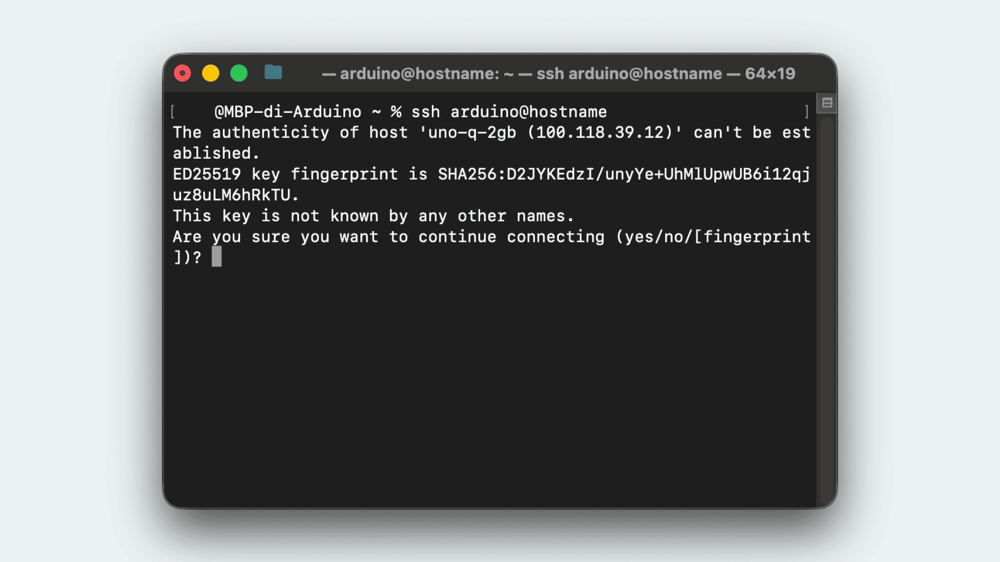
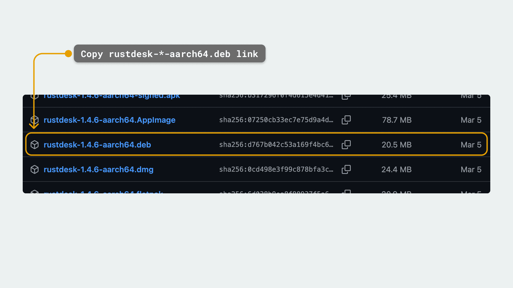
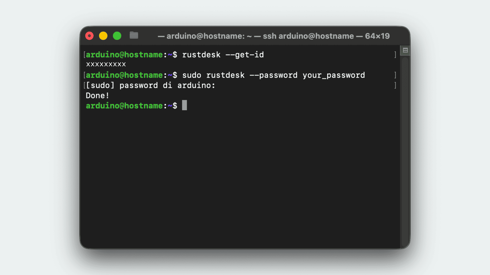
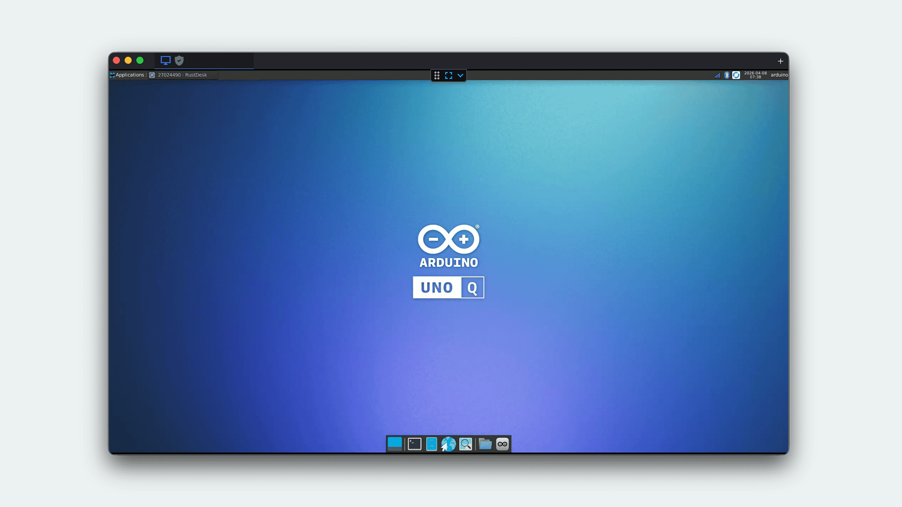
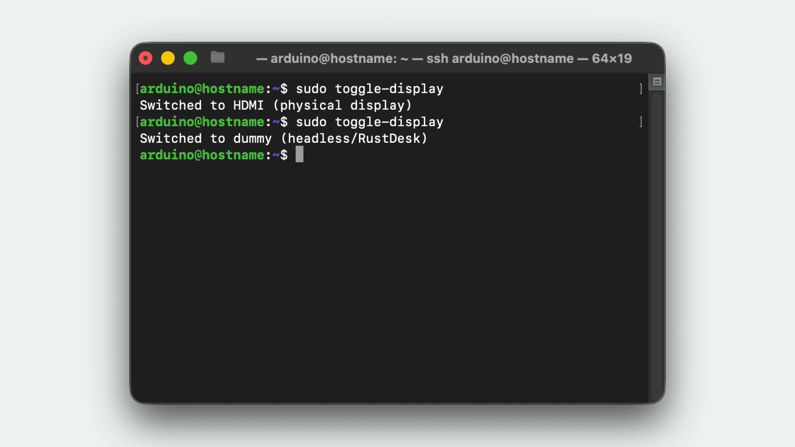

This tutorial covers how to access your [Arduino® UNO Q](https://store.arduino.cc/products/uno-q) remotely from outside your local network. We will cover three methods:

1. **Tailscale + SSH:** For secure command-line access from anywhere.
2. **xrdp (Remote Desktop):** For graphical desktop access over USB, LAN, or VPN using the standard RDP protocol.
3. **RustDesk:** For full graphical desktop access using a third-party open-source solution.

## 1. Tailscale + SSH

[Tailscale](https://tailscale.com/) is a zero-config VPN that creates a secure network between your devices. By installing Tailscale on your UNO Q and your computer, you can SSH into your board from anywhere as if it were on your local network.

### Installing Tailscale On UNO Q

1. Connect to your UNO Q via SSH or open a terminal in desktop mode.
2. Install Tailscale by running the following command:

   ```bash
   curl -fsSL https://tailscale.com/install.sh | sh
   ```

3. Authenticate and connect the board to your Tailscale network:

   ```bash
   sudo tailscale up
   ```

   *Follow the provided link to authenticate with your Tailscale account.*

### Connecting Via SSH

Once both your computer and the UNO Q are connected to the same Tailscale network, you can find the board's Tailscale IP address in the Tailscale admin console or by running `tailscale ip -4` on the board.

From your computer, SSH into the board using its Tailscale IP:

```bash
ssh arduino@<tailscale-ip>
```



---

## 2. Xrdp (Remote Desktop)

[xrdp](http://www.xrdp.org/) is an open-source RDP (Remote Desktop Protocol) server for Linux. RDP is the de facto standard for remote desktop access, and RDP clients are available on all major platforms — Remote Desktop is even pre-installed on Windows machines. On Debian-based systems like the UNO Q, xrdp works out of the box with minimal configuration.

### Installing Xrdp On UNO Q

Connect to your UNO Q via SSH or ADB shell, then install xrdp and its dependencies:

```bash
sudo apt update
sudo apt install xrdp dbus-x11
sudo systemctl enable xrdp
sudo systemctl start xrdp
```

Verify that xrdp is running:

```bash
sudo systemctl status xrdp
```

The service listens on port `3389` by default.

### RDP Clients

Install an RDP client on your computer:

- **Windows:** Remote Desktop Connection is pre-installed. Open it by searching for `mstsc` or "Remote Desktop Connection" in the Start menu.
- **macOS:** Install [Windows App](https://apps.apple.com/app/windows-app/id1295203466) (formerly Microsoft Remote Desktop) from the App Store.
- **Linux:** Install [Remmina](https://remmina.org/):

  ```bash
  sudo apt install remmina
  ```

### RDP Over LAN (Ethernet / Wi-Fi®)

If the UNO Q is connected to the same local network as your computer (via Ethernet or Wi-Fi®), you can connect directly using the board's local IP address.

1. On the UNO Q, find its IP address:

   ```bash
   hostname -I
   ```

2. On your computer, open your RDP client and connect to `<board-ip>:3389`.
3. Log in with your UNO Q credentials (default user: `arduino`).

### RDP Over USB Via ADB Forward

If you do not have network access on the UNO Q, you can tunnel the RDP connection over USB using ADB port forwarding.

1. Connect the UNO Q to your computer via USB-C®.
2. Ensure ADB is installed on your computer (see the [ADB tutorial](/tutorials/uno-q/adb/) for installation instructions).
3. Forward the RDP port through ADB:

   ```bash
   adb forward tcp:3389 tcp:3389
   ```

4. Open your RDP client and connect to `localhost:3389`.
5. Log in with your UNO Q credentials (default user: `arduino`).

***To stop the port forward when you are done, run `adb forward --remove tcp:3389`.***

### RDP Over VPN (Tailscale)

To access the UNO Q desktop remotely from a different network, combine xrdp with a VPN like [Tailscale](https://tailscale.com/). If you have already set up Tailscale as described in [Section 1](#1-tailscale--ssh), you can connect to the board's Tailscale IP using your RDP client.

1. Ensure Tailscale is running on both the UNO Q and your computer.
2. Find the board's Tailscale IP:

   ```bash
   tailscale ip -4
   ```

3. Open your RDP client and connect to `<tailscale-ip>:3389`.
4. Log in with your UNO Q credentials (default user: `arduino`).

This provides full graphical desktop access from anywhere in the world, without exposing port `3389` to the public internet.

### Troubleshooting: Black Screen On Connect

If xrdp connects but immediately shows a black screen and disconnects, the cause is usually a conflict with the desktop session already running on the board.

When the UNO Q boots, it starts a local desktop session managed by LightDM (the login screen and session manager). That session is already signed in as the `arduino` user and is using the board's main display. When you then connect over xrdp, it tries to start a *second* desktop session for your remote connection, but the two sessions end up sharing resources that only one session can own at a time, most notably the per-user message bus (D-Bus) that desktop apps use to talk to each other. Since the local session got there first, the remote one fails to start cleanly and kicks you out, which is what you see as a black screen.

The fix is to tell xrdp to start its remote desktop session in complete isolation from the local one, with its own private message bus. Overwrite the xrdp startup script:

```bash
sudo tee /etc/xrdp/startwm.sh << 'EOF'
#!/bin/sh
unset DBUS_SESSION_BUS_ADDRESS
unset XDG_RUNTIME_DIR
if [ -r /etc/profile ]; then
    . /etc/profile
fi
exec dbus-run-session -- xfce4-session
EOF
```

Then restart xrdp:

```bash
sudo systemctl restart xrdp
```

***If you are using a different desktop environment, replace `xfce4-session` with the appropriate command. Check available sessions with `ls /usr/share/xsessions/`.***

---

## 3. RustDesk (Desktop Access)

[RustDesk](https://rustdesk.com/) is an open-source remote desktop software. Since the UNO Q can be run headlessly (without a physical monitor), we will configure a dummy display driver so that the desktop environment loads and can be accessed remotely.

### Install RustDesk

First, find the link for the latest `aarch64.deb` package on the [RustDesk Releases page](https://github.com/rustdesk/rustdesk/releases/latest). 



Connect to your board (via SSH or terminal) and download it using `wget`. Then, install it using a wildcard (`*`) so the command works regardless of the downloaded version:

```bash
wget <PASTE_DOWNLOAD_LINK_HERE>
sudo dpkg -i rustdesk-*-aarch64.deb
sudo apt -f install
```

### Install And Configure Dummy Display

Install the dummy display driver:

```bash
sudo apt install xserver-xorg-video-dummy
sudo mkdir -p /etc/X11/xorg.conf.d
```

Create the configuration file:

```bash
sudo tee /etc/X11/xorg.conf.d/10-dummy.conf << 'EOF'
Section "Device"
    Identifier "DummyDevice"
    Driver "dummy"
    VideoRam 256000
    Option "IgnoreEDID" "true"
EndSection

Section "Monitor"
    Identifier "DummyMonitor"
    HorizSync 28.0-80.0
    VertRefresh 48.0-75.0
    Modeline "1920x1080" 148.50 1920 2008 2052 2200 1080 1084 1089 1125
EndSection

Section "Screen"
    Identifier "DummyScreen"
    Device "DummyDevice"
    Monitor "DummyMonitor"
    DefaultDepth 24
    SubSection "Display"
        Depth 24
        Modes "1920x1080"
    EndSubSection
EndSection
EOF
```

### Configure LightDM Auto-Login

Set up LightDM to automatically log in the `arduino` user (replace `arduino` with your username if it is different):

```bash
sudo tee -a /etc/lightdm/lightdm.conf << 'EOF'
[Seat:*]
autologin-user=arduino
EOF
```

### Enable RustDesk and Reboot

Enable the RustDesk service and reboot the board:

```bash
sudo systemctl enable rustdesk
sudo reboot
```

### Set RustDesk Password

After the board has rebooted, reconnect via SSH to retrieve your RustDesk ID and set a password:

```bash
rustdesk --get-id
sudo rustdesk --password your_password
```



*Note down the ID — you'll need it to connect.*

### Connect

Install RustDesk on your client device (macOS, iOS, Windows, Linux) from [rustdesk.com](https://rustdesk.com/). Enter the board's ID and password. This works across different networks from anywhere in the world.



### Toggle Between HDMI and Headless Mode

The dummy driver overrides the real GPU, meaning if you plug in a physical monitor via HDMI, it will show a black screen while the dummy driver is active. 

You can create a script to easily toggle between the dummy display and the physical HDMI output:

```bash
sudo tee /usr/local/bin/toggle-display << 'EOF'
#!/bin/bash
CONF="/etc/X11/xorg.conf.d/10-dummy.conf"
BAK="${CONF}.bak"

if [ -f "$CONF" ]; then
    mv "$CONF" "$BAK"
    echo "Switched to HDMI (physical display)"
else
    mv "$BAK" "$CONF"
    echo "Switched to dummy (headless/RustDesk)"
fi
systemctl restart lightdm
EOF

sudo chmod +x /usr/local/bin/toggle-display
```

Switch anytime by running:

```bash
sudo toggle-display
```


### After Reboot

Everything starts automatically: LightDM auto-logs in on the dummy display, RustDesk runs, and the desktop is accessible remotely from any device.
