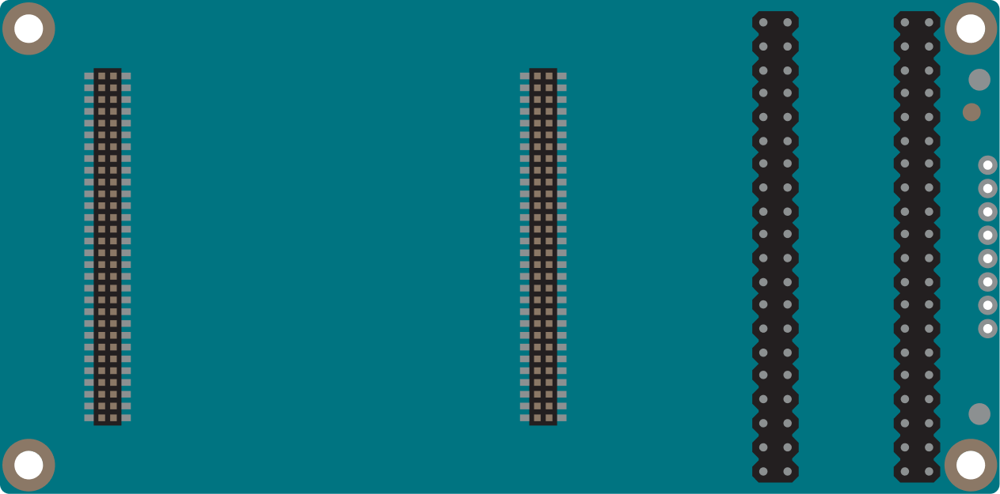
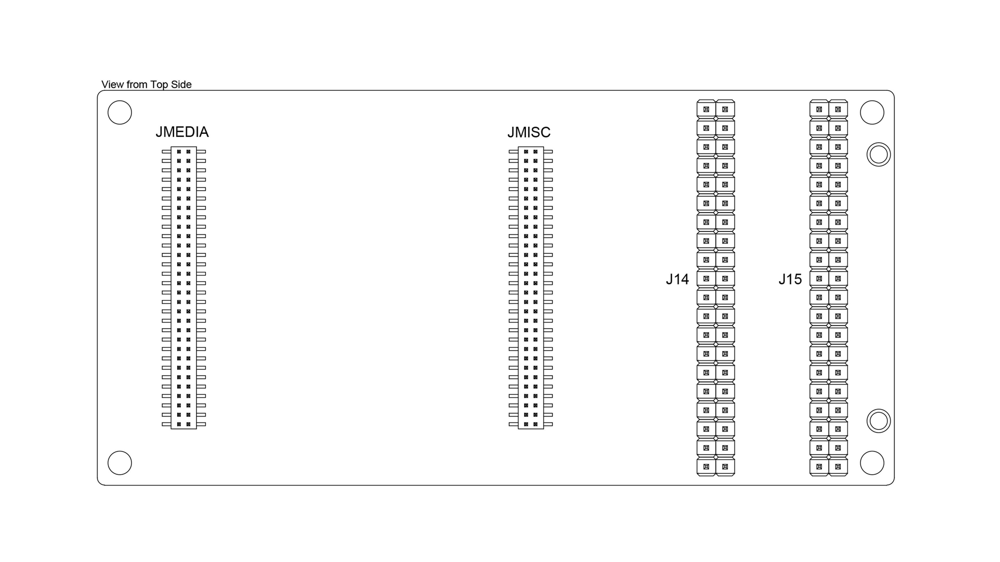
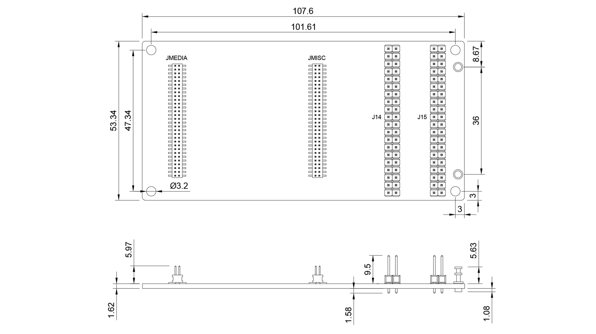
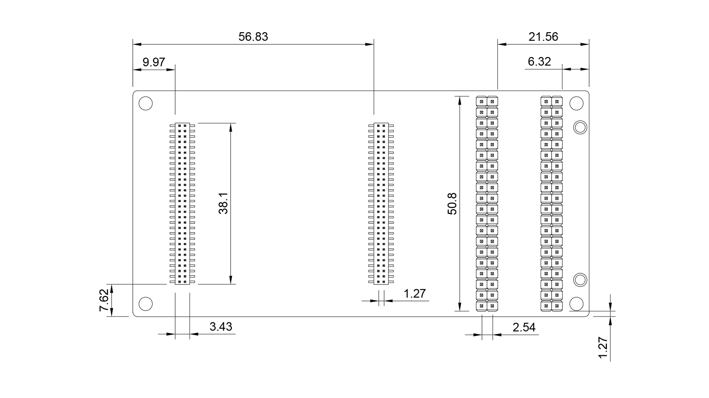

# Description

The Arduino UNO Breakout Carrier is designed to give developers complete, direct access to every signal available on the UNO Q’s JMEDIA and JMISC high-speed connectors. Ideal for advanced prototyping, testing, and integration work, it exposes all lines — including high-speed video, camera, audio, I²C, SPI, UART, PWM, power rails, and control signals — to clearly labeled, easy-to-use breakout headers.

# Features

* Connectors
  * Two 2x20 Male Headers (2.54 mm)
  * Two 2x30 Male Headers(JMEDIA and JMISC 1.27 mm)
  * 1x8 through-hole pads (2.54 mm)
* Power
  * Powered from the host UNO Q
  * VIN input power rails (+7-24 VDC)
* I/O
  * I2C
  * Microphone In / Headphone Out
  * Earphone Out
  * Audio Line Out
  * PWM
  * PSSI
  * GPIO

# Contents
## The Board

### Related Products
*   Arduino UNO Q (SKU: ABX00162 - ABX00173)

## Ratings

### Recommended Operating Conditions
|     Symbol     |         Description         |  Min  |  Typ  |  Max  | Unit  |
| :------------: | :-------------------------: | :---: | :---: | :---: | :---: |
|       T        | Conservative thermal limits |  -10  |  20   |  60   |  °C   |
| VIN | Input voltage from VIN pad  |   6   |   7   |  24   |   V   |

## Functional Overview

The UNO Breakout Carrier expands the connectivity of the Arduino UNO Q, featuring a variety of 2.54 mm male header connectors.

### Board Topology

| **Ref.** |                **Description**                |
| :------: | :-------------------------------------------: |
|   J14    |      Male header connector 2x20 2.54 mm       |
|   J15    |      Male header connector 2x20 2.54 mm       |
|  JMEDIA  | High-speed male header connector 2x30 1.27 mm |
|  JMISC   | High-speed male header connector 2x30 1.27 mm |

### Pinout

The UNO Breakout Carrier pinout is shown in the following figure.

#### J14

| Pin | Function  | Type          | Description                          |
| --- | --------- | ------------- | ------------------------------------ |
| 1   | VIN       | Power In      | Voltage Input                        |
| 2   | GPIO_20   | Digital       | SOC_CAM_MCLK0                        |
| 3   | VIN       | Power In      | Voltage Input                        |
| 4   | GPIO_21   | Digital       | SOC_CAM_MCLK1                        |
| 5   | GND       | Ground        | Ground                               |
| 6   | GND       | Ground        | Ground                               |
| 7   | +5V USB   | Power Out     | +5V USB Power Output                 |
| 8   | GPIO_23   | Digital / I2C | CCI_I2C_SCL0                         |
| 9   | +5V USB   | Power Out     | +5V USB Power Output                 |
| 10  | GPIO_22   | Digital / I2C | CCI_I2C_SDA0                         |
| 11  | GND       | Ground        | Ground                               |
| 12  | GND       | Ground        | Ground                               |
| 13  | +3V3      | Power Out     | +3.3V Power Output                   |
| 14  | GPIO_29   | Digital / I2C | CCI_I2C_SDA1                         |
| 15  | +3V3      | Power Out     | +3.3V Power Output                   |
| 16  | GPIO_30   | Digital / I2C | CCI_I2C_SCL1                         |
| 17  | GND       | Ground        | Ground                               |
| 18  | GND       | Ground        | Ground                               |
| 19  | +1V8      | Power Out     | +1.8V Power Output                   |
| 20  | MIC2_INP  | Analog        | Microphone Input Positive            |
| 21  | +1V8      | Power Out     | +1.8V Power Output                   |
| 22  | MIC2_INM  | Analog        | Microphone Input Negative            |
| 23  | GND       | Ground        | Ground                               |
| 24  | MIC2_BIAS | Analog        | Microphone Bias                      |
| 25  | GND       | Ground        | Ground                               |
| 26  | GND       | Ground        | Ground                               |
| 27  | LINEOUT_P | Analog        | Audio Line Out Positive              |
| 28  | EAR_P_R   | Analog        | Ear Right Positive                   |
| 29  | LINEOUT_M | Analog        | Audio Line Out Negative              |
| 30  | EAR_M_R   | Analog        | Ear Right Negative                   |
| 31  | GND       | Ground        | Ground                               |
| 32  | GND       | Ground        | Ground                               |
| 33  | GND       | Ground        | Ground                               |
| 34  | HPH_L     | Analog        | Headphone Left                       |
| 35  | VBAT      | Power Out     | +3.8V Buck Converter Output          |
| 36  | HPH_R     | Analog        | Headphone Right                      |
| 37  | GND       | Ground        | Ground                               |
| 38  | HPH_REF   | Analog        | Headphone Reference                  |
| 39  | VCOIN     | Power In      | Coin Cell / RTC Backup Voltage Input |
| 40  | HS_DET    | Analog        | Headphone Detection                  |

#### J15

| Pin | Function              | Type          | Description           |
| --- | --------------------- | ------------- | --------------------- |
| 1   | MCU_PSSI_D0 / PC6     | Digital       | MCU GPIO              |
| 2   | MCU_SDMMC1_CMD / PD2  | Digital       | MCU GPIO              |
| 3   | MCU_PSSI_D1 / PC7     | Digital       | MCU GPIO              |
| 4   | MCU_TRACE_CLK / PE2   | Digital       | MCU GPIO              |
| 5   | MCU_PSSI_D2 / PC8     | Digital       | MCU GPIO              |
| 6   | MCU_TRACE_D0 / PE3    | Digital       | MCU GPIO              |
| 7   | MCU_PSSI_D3 / PC9     | Digital       | MCU GPIO              |
| 8   | MCU_TRACE_D2 / PE5    | Digital       | MCU GPIO              |
| 9   | MCU_PSSI_D4 / PE4     | Digital       | MCU GPIO              |
| 10  | MCU_TRACE_D3 / PE6    | Digital       | MCU GPIO              |
| 11  | MCU_PSSI_D5 / PI4     | Digital       | MCU GPIO              |
| 12  | MCU_PE7 / PE7         | Digital       | MCU GPIO              |
| 13  | MCU_PSSI_D6 / PI6     | Digital       | MCU GPIO              |
| 14  | MCU_PE8 / PE8         | Digital       | MCU GPIO              |
| 15  | MCU_PSSI_D7 / PI7     | Digital       | MCU GPIO              |
| 16  | MCU_I2C4_SCL / PF14   | Digital / I2C | MCU GPIO              |
| 17  | MCU_PSSI_PDCK / PD9   | Digital       | MCU GPIO              |
| 18  | MCU_I2C4_SDA / PF15   | Digital / I2C | MCU GPIO              |
| 19  | MCU_PSSI_RDY / PI5    | Digital       | MCU GPIO              |
| 20  | MCU_OPAMP1_VOUT / PA3 | Analog        | MCU GPIO / OPAMP OUT  |
| 21  | MCU_PSSI_DE / PD8     | Digital       | MCU GPIO              |
| 22  | MCU_OPAMP1_VINP / PA0 | Analog        | MCU GPIO / OPAMP IN + |
| 23  | GND                   | Ground        | Ground                |
| 24  | MCU_OPAMP1_VINM / PA1 | Analog        | MCU GPIO / OPAMP IN - |
| 25  | SOC_GPIO_0_SE0        | Digital       | MPU GPIO              |
| 26  | MCU_MCO / PA8         | Digital       | MCU GPIO              |
| 27  | SOC_GPIO_1_SE0        | Digital       | MPU GPIO              |
| 28  | MCU_CRS_SYNC / PA10   | Digital       | MCU GPIO              |
| 29  | SOC_GPIO_2_SE0        | Digital       | MPU GPIO              |
| 30  | GND                   | Ground        | Ground                |
| 31  | SOC_GPIO_3_SE0        | Digital       | MPU GPIO              |
| 32  | SOC_GPIO_98           | Digital       | MPU GPIO              |
| 33  | SOC_GPIO_86_SE0       | Digital       | MPU GPIO              |
| 34  | SOC_GPIO_99           | Digital       | MPU GPIO              |
| 35  | SOC_GPIO_82_SE0       | Digital       | MPU GPIO              |
| 36  | SOC_GPIO_100          | Digital       | MPU GPIO              |
| 37  | SOC_GPIO_18           | Digital       | MPU GPIO              |
| 38  | SOC_GPIO_101          | Digital       | MPU GPIO              |
| 39  | SOC_GPIO_20           | Digital       | MPU GPIO              |
| 40  | GND                   | Ground        | Ground                |

#### JMEDIA

| Pin | Function                | Type      | Description        |
| --- | ----------------------- | --------- | ------------------ |
| 1   | GND                     | Ground    | Ground             |
| 2   | GND                     | Ground    | Ground             |
| 3   | NC                      | None      | Not Connected      |
| 4   | NC                      | None      | Not Connected      |
| 5   | NC                      | None      | Not Connected      |
| 6   | NC                      | None      | Not Connected      |
| 7   | GND                     | Ground    | Ground             |
| 8   | GND                     | Ground    | Ground             |
| 9   | NC                      | None      | Not Connected      |
| 10  | NC                      | None      | Not Connected      |
| 11  | GND                     | Ground    | Ground             |
| 12  | NC                      | None      | Not Connected      |
| 13  | GND                     | Ground    | Ground             |
| 14  | GND                     | Ground    | Ground             |
| 15  | NC                      | None      | Not Connected      |
| 16  | SOC_CAM_MCLK0 / GPIO_20 | Digital   | MPU GPIO           |
| 17  | NC                      | None      | Not Connected      |
| 18  | SOC_CAM_MCLK1 / GPIO_21 | Digital   | MPU GPIO           |
| 19  | GND                     | Ground    | Ground             |
| 20  | GND                     | Ground    | Ground             |
| 21  | NC                      | None      | Not Connected      |
| 22  | CCI_I2C_SDA1 / GPIO_29  | I2C       | MPU GPIO           |
| 23  | NC                      | None      | Not Connected      |
| 24  | CCI_I2C_SCL1 / GPIO_30  | I2C       | MPU GPIO           |
| 25  | GND                     | Ground    | Ground             |
| 26  | GND                     | Ground    | Ground             |
| 27  | NC                      | None      | Not Connected      |
| 28  | NC                      | None      | Not Connected      |
| 29  | NC                      | None      | Not Connected      |
| 30  | NC                      | None      | Not Connected      |
| 31  | GND                     | Ground    | Ground             |
| 32  | GND                     | Ground    | Ground             |
| 33  | NC                      | None      | Not Connected      |
| 34  | NC                      | None      | Not Connected      |
| 35  | NC                      | None      | Not Connected      |
| 36  | NC                      | None      | Not Connected      |
| 37  | GND                     | Ground    | Ground             |
| 38  | GND                     | Ground    | Ground             |
| 39  | NC                      | None      | Not Connected      |
| 40  | NC                      | None      | Not Connected      |
| 41  | NC                      | None      | Not Connected      |
| 42  | NC                      | None      | Not Connected      |
| 43  | GND                     | Ground    | Ground             |
| 44  | GND                     | Ground    | Ground             |
| 45  | NC                      | None      | Not Connected      |
| 46  | NC                      | None      | Not Connected      |
| 47  | NC                      | None      | Not Connected      |
| 48  | NC                      | None      | Not Connected      |
| 49  | GND                     | Ground    | Ground             |
| 50  | GND                     | Ground    | Ground             |
| 51  | NC                      | None      | Not Connected      |
| 52  | CCI_I2C_SCL0 / GPIO_23  | I2C       | MPU GPIO           |
| 53  | NC                      | None      | Not Connected      |
| 54  | CCI_I2C_SDA0 / GPIO_22  | I2C       | MPU GPIO           |
| 55  | GND                     | Ground    | Ground             |
| 56  | GND                     | Ground    | Ground             |
| 57  | VIN                     | Power In  | Voltage Input      |
| 58  | +3V3                    | Power Out | +3.3V Power Output |
| 59  | VIN                     | Power In  | Voltage Input      |
| 60  | +3V3                    | Power Out | +3.3V Power Output |

#### JMISC

| Pin | Function              | Type          | Description                          |
| --- | --------------------- | ------------- | ------------------------------------ |
| 1   | MCU_PSSI_D0 / PC6     | Digital       | MCU GPIO                             |
| 2   | MCU_SDMMC1_CMD / PD2  | Digital       | MCU GPIO                             |
| 3   | MCU_PSSI_D1 / PC7     | Digital       | MCU GPIO                             |
| 4   | MCU_TRACE_CLK / PE2   | Digital       | MCU GPIO                             |
| 5   | MCU_PSSI_D2 / PC8     | Digital       | MCU GPIO                             |
| 6   | MCU_TRACE_D0 / PE3    | Digital       | MCU GPIO                             |
| 7   | MCU_PSSI_D3 / PC9     | Digital       | MCU GPIO                             |
| 8   | MCU_TRACE_D2 / PE5    | Digital       | MCU GPIO                             |
| 9   | MCU_PSSI_D4 / PE4     | Digital       | MCU GPIO                             |
| 10  | MCU_TRACE_D3 / PE6    | Digital       | MCU GPIO                             |
| 11  | MCU_PSSI_D5 / PI4     | Digital       | MCU GPIO                             |
| 12  | MCU_PE7 / PE7         | Digital       | MCU GPIO                             |
| 13  | MCU_PSSI_D6 / PI6     | Digital       | MCU GPIO                             |
| 14  | MCU_PE8 / PE8         | Digital       | MCU GPIO                             |
| 15  | MCU_PSSI_D7 / PI7     | Digital       | MCU GPIO                             |
| 16  | MCU_I2C4_SCL / PF14   | Digital / I2C | MCU GPIO                             |
| 17  | MCU_PSSI_PDCK / PI9   | Digital       | MCU GPIO                             |
| 18  | MCU_I2C4_SDA / PF15   | Digital / I2C | MCU GPIO                             |
| 19  | MCU_PSSI_RDY / PI5    | Digital       | MCU GPIO                             |
| 20  | MCU_OPAMP1_VOUT / PA3 | Analog        | MCU GPIO / OPAMP OUT                 |
| 21  | MCU_PSSI_DE / PD8     | Digital       | MCU GPIO                             |
| 22  | MCU_OPAMP1_VINP / PA0 | Analog        | MCU GPIO / OPAMP IN +                |
| 23  | MCU_MCO / PA8         | Digital       | MCU GPIO                             |
| 24  | MCU_OPAMP1_VINM / PA1 | Analog        | MCU GPIO / OPAMP IN -                |
| 25  | MCU_CRS_SYNC / PA10   | Digital       | MCU GPIO                             |
| 26  | GND                   | Ground        | Ground                               |
| 27  | GND                   | Ground        | Ground                               |
| 28  | EAR_P_R               | Analog        | Ear Right Positive                   |
| 29  | MIC2_INP              | Analog        | Microphone Input Positive            |
| 30  | EAR_M_R               | Analog        | Ear Right Negative                   |
| 31  | MIC2_INM              | Analog        | Microphone Input Negative            |
| 32  | LINEOUT_P             | Analog        | Audio Line Out Positive              |
| 33  | MIC2_BIAS             | Analog        | Microphone Bias                      |
| 34  | LINEOUT_M             | Analog        | Audio Line Out Negative              |
| 35  | GND                   | Ground        | Ground                               |
| 36  | HPH_L                 | Analog        | Headphone Left                       |
| 37  | SOC_GPIO_0_SE0        | Digital       | MPU GPIO                             |
| 38  | HPH_R                 | Analog        | Headphone Right                      |
| 39  | SOC_GPIO_1_SE0        | Digital       | MPU GPIO                             |
| 40  | HPH_REF               | Analog        | Headphone Reference                  |
| 41  | SOC_GPIO_2_SE0        | Digital       | MPU GPIO                             |
| 42  | HS_DET                | Analog        | Headset Detection                    |
| 43  | SOC_GPIO_3_SE0        | Digital       | MPU GPIO                             |
| 44  | GND                   | Ground        | Ground                               |
| 45  | SOC_GPIO_86_SE0       | Digital       | MPU GPIO                             |
| 46  | SOC_GPIO_98           | Digital       | MPU GPIO                             |
| 47  | SOC_GPIO_82_SE0       | Digital       | MPU GPIO                             |
| 48  | SOC_GPIO_99           | Digital       | MPU GPIO                             |
| 49  | SOC_GPIO_18           | Digital       | MPU GPIO                             |
| 50  | SOC_GPIO_100          | Digital       | MPU GPIO                             |
| 51  | SOC_GPIO_28           | Digital       | MPU GPIO                             |
| 52  | SOC_GPIO_101          | Digital       | MPU GPIO                             |
| 53  | +3V3                  | Power Out     | +3.3V Power Output                   |
| 54  | +5V USB               | Power Out     | +5V USB Power Output                 |
| 55  | +3V3                  | Power Out     | +3.3V Power Output                   |
| 56  | +5V USB               | Power Out     | +5V USB Power Output                 |
| 57  | +1V8                  | Power Out     | +1.8V Power Output                   |
| 58  | GND                   | Ground        | Ground                               |
| 59  | VCOIN                 | Power In      | Coin Cell / RTC Backup Voltage Input |
| 60  | VBAT                  | Power Out     | +3.8V Buck Converter Output          |

## Mechanical Information

### Board Dimensions

The outline and dimensions of the UNO Breakout Carrier and mounting holes can be seen in the following figure;
all the dimensions are in mm.

### Board Connectors

The UNO Breakout Carrier's connectors are placed on the top side of the board, as shown in the figure below; all
the dimensions are in mm.

## Company Information
| Company name    | Arduino S.r.l.                               |
| --------------- | -------------------------------------------- |
| Company Address | Via Andrea Appiani, 25 - 20900 MONZA (Italy) |

## Reference Documentation
|          **Ref**          | **Link**                                                     |
| :-----------------------: | ------------------------------------------------------------ |
|   Arduino IDE (Desktop)   | https://www.arduino.cc/en/Main/Software                      |
|    Arduino IDE (Cloud)    | https://create.arduino.cc/editor                             |
| Cloud IDE Getting Started | https://create.arduino.cc/projecthub/Arduino_Genuino/getting-started-with-arduino-web-editor-4b3e4a |
|    Arduino Pro Website    | https://www.arduino.cc/pro                                   |
|        Project Hub        | https://create.arduino.cc/projecthub?by=part&part_id=11332&sort=trending |
|     Library Reference     | https://www.arduino.cc/reference/en/                         |
|       Online Store        | https://store.arduino.cc/                                    |

## Change Log
| **Date**   | **Revision** | **Changes**                                 |
|------------|--------------|---------------------------------------------|
| 06/03/2026 | 1            | First Release                               |