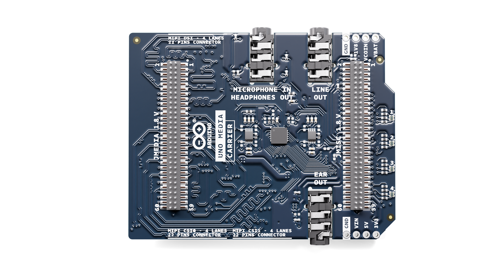
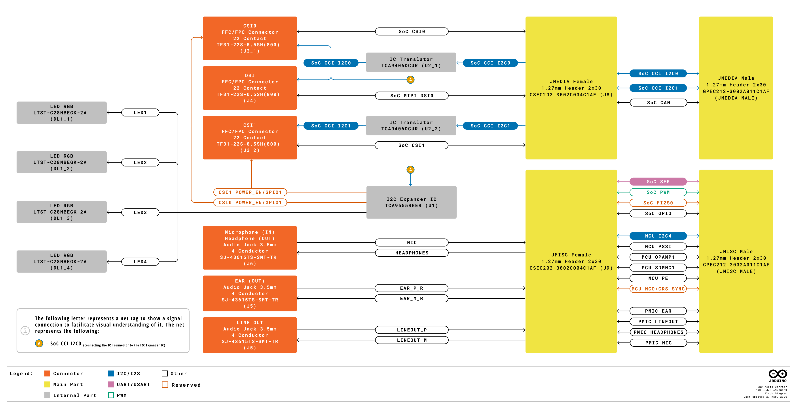
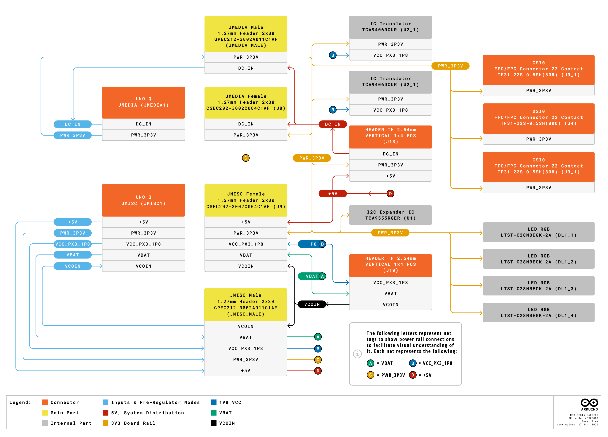
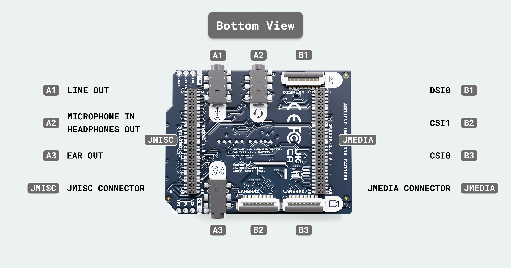
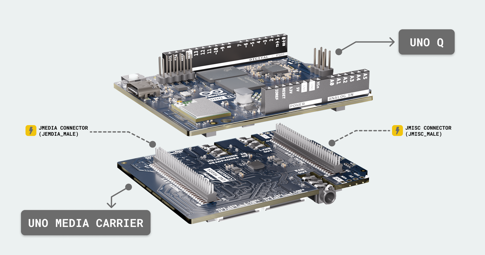

# Description

The Arduino UNO Media Carrier extends the multimedia capabilities of compatible host boards, enabling advanced vision, display, and audio applications with plug-and-play simplicity. Designed for easy integration, it connects via the JMEDIA and JMISC high-speed connectors, both of which feature passthrough designs to keep all pins available for additional modules or carriers in your setup.

Equipped with two MIPI CSI connectors for standard Raspberry Pi cameras, the carrier opens the door to dual-camera computer vision projects, from stereo depth mapping to multi-angle image capture. A MIPI DSI interface provides compatibility with Raspberry Pi displays, making it easy to add rich, interactive visual output to your projects without additional adapters. For audio, the carrier includes three dedicated 3.5 mm jacks: one combined microphone input and headphone output for flexible audio capture and monitoring, one line out for connecting to amplifiers or powered speakers, and one ear out for direct connection to earphones.

 Together, these interfaces enable a complete edge multimedia hub, ideal for AI-powered kiosks, object tracking, interactive installations, and more.

# Target Areas

Makers and advanced hobbyists, educational institutions and training centers, prototyping teams and startups

# CONTENTS

## Application Examples

The UNO Media Carrier expands the multimedia capabilities of compatible host boards, enabling dual-camera computer vision, interactive displays, and multi-channel audio applications. With plug-and-play compatibility for Raspberry Pi cameras and displays, the carrier simplifies hardware integration for a wide range of multimedia projects.

- **Computer Vision and AI:** Stereo depth mapping for robotics, dual-camera object tracking for automated inspection systems, and gesture recognition interfaces using synchronized camera inputs.

- **Interactive Displays and Kiosks:** AI-powered smart kiosks with touchscreen displays, interactive museum exhibits with real-time visual feedback, and digital signage with camera-based audience analytics.

- **Education and Research:** Computer vision lab projects for teaching image processing and machine learning, real-time video analysis experiments, and multimedia IoT course demonstrations with integrated audio-visual feedback.

- **Prototyping and Development:** Rapid proof-of-concept development for smart retail solutions, early-stage testing of telepresence systems with integrated audio and video, and hardware validation for multimedia edge devices.

- **Audio-Visual Applications:** Voice-controlled interactive systems with headphone feedback, multimedia recording stations with line-level audio output, and hands-free communication devices using microphone input and earphone output.

# CONTENTS

## Features

### General Specifications Overview

#### Connectivity & Media

| **Component**     | **Details**                                                                                                       |
|-------------------|-------------------------------------------------------------------------------------------------------------------|
| Camera Connectors | - 2× MIPI-CSI 22-pin camera connectors  - Raspberry Pi camera compatible                                   |
| Display Connector | - 1× MIPI-DSI 22-pin display connector  - Raspberry Pi display compatible                                  |
| Audio Connectors  | - 1× MIC-IN / Headphones Out 3.5 mm jack  - 1× Line Out 3.5 mm jack  - 1× Earphones Out 3.5 mm jack |

#### Board Interface & Expansion

| **Component**         | **Details**                                                                                                                             |
|-----------------------|-----------------------------------------------------------------------------------------------------------------------------------------|
| Host Board Connection | - JMEDIA high-speed connector  - JMISC high-speed connector  - Passthrough design maintains pin availability              |
| Available Interfaces  | - I2C  - MIPI-CSI  - MIPI-DSI  - PSSI  - GPIO  - Audio endpoints (HP OUT, LINE OUT, MIC IN, EAR OUT) |

## Ratings

### Power Rails

| **Source**                    | **Voltage** | **Notes**                                      |
|-------------------------------|------------:|------------------------------------------------|
| Host board (via JMEDIA/JMISC) |           - | Power source from host board                   |
| VIN (DC IN)                   |   7-24 V DC | DC power input for high-power configurations   |
| VCOIN                         |    3.0 V DC | Coin cell input for host board RTC (max 3.6 V) |

### Recommended Operating Conditions

| **Parameter**         | **Minimum** | **Typical** | **Maximum** | **Unit** |
|-----------------------|:-----------:|:-----------:|:-----------:|:--------:|
| Operating temperature |  -10 (14)   |      -      |  60 (140)   | °C (°F)  |

## Functional Overview

### Block Diagram

### Power Tree

### Pinout

### Camera Interfaces

The UNO Media Carrier provides two MIPI-CSI 22-pin camera connectors, compatible with standard Raspberry Pi cameras. These allow dual-camera computer vision applications such as stereo vision, depth mapping, or multi-angle capture.

| **Connector** | **Type** | **Pin Count** |
|---------------|----------|:-------------:|
| CSI0          | MIPI-CSI |      22       |
| CSI1          | MIPI-CSI |      22       |

### Display Interface

The UNO Media Carrier includes one MIPI-DSI 22-pin display connector, compatible with Raspberry Pi displays for visual output in interactive applications.

| **Connector** | **Type** | **Pin Count** |
|---------------|----------|:-------------:|
| DSI0          | MIPI-DSI |      22       |

### Audio Interfaces

The carrier provides three 3.5 mm audio jacks for flexible audio input and output.

| **Jack**                | **Type**    | **Function**                                   |
|-------------------------|-------------|------------------------------------------------|
| MIC-IN / Headphones Out | 3.5 mm jack | Combined microphone input and headphone output |
| Line Out                | 3.5 mm jack | Line-level audio output                        |
| Earphones Out           | 3.5 mm jack | Earphone output                                |

### Additional Interfaces

Through the JMEDIA and JMISC connectors, the UNO Media Carrier also provides access to:

- **I2C:** For camera control and other peripheral communication
- **PSSI:** Parallel camera interface available through JMISC
- **GPIO:** General-purpose I/O pins available through JMISC

## Peripherals

- **LINE OUT (A1):** 3.5 mm audio jack for audio output. Signals routed through JMISC analog audio endpoints (`LINEOUT_P`, `LINEOUT_M`).
- **MICROPHONE IN / HEADPHONES OUT (A2):** 3.5 mm jack supporting microphone input and headphone output. Microphone signals (`MIC2_INP`, `MIC2_INN`, `MIC2_BIAS`) and headphone signals (`HPH_L`, `HPH_R`, `HPH_REF`, `HS_DET`) routed through JMISC.
- **EAR OUT (A3):** 3.5 mm audio jack for earphone connection. Signals routed through JMISC analog audio endpoints (`EAR_P_R`, `EAR_M_R`).
- **DSI0 (B1):** 22-pin MIPI-DSI display connector compatible with Raspberry Pi displays. Operates at 1.8 V logic level, routed from JMEDIA connector.
- **CSI1 (B2):** 22-pin MIPI-CSI camera connector compatible with Raspberry Pi cameras. Operates at 1.8 V logic level, routed from JMEDIA connector. Camera 1 interface.
- **CSI0 (B3):** 22-pin MIPI-CSI camera connector compatible with Raspberry Pi cameras. Operates at 1.8 V logic level, routed from JMEDIA connector. Camera 0 interface.
- **JMEDIA CONNECTOR (JMEDIA):** Female 60-pin high-speed connector interfacing with the host board's JMEDIA header. Routes MIPI-CSI camera signals (`CSI0`, `CSI1`), MIPI-DSI display signals (DSI0), Camera Control Interface I2C (`CCI_I2C0`, `CCI_I2C1`), camera master clocks (CAM_MCLK0, CAM_MCLK1), and power rails. Signals operate at 1.8 V logic level. Passthrough design maintains pin availability for stacking.
- **JMISC CONNECTOR (JMISC):** Female 60-pin mixed-voltage connector interfacing with the host board's JMISC header. Routes SoC GPIO (1.8 V), MCU GPIO and peripherals (3.3 V), analog audio signals, debug or trace interfaces, and power rails (`+3V3`, `+5V_USB`, `+1V8`, `VBAT`, `VCOIN`). Passthrough design maintains pin availability for stacking.

MIPI-CSI and MIPI-DSI signals operate in the 1.8 V DC domain. Camera Control Interface (CCI) I2C buses provide camera configuration and control. Audio signals are analog and referenced to ground. Level translation is required when interfacing 1.8 V DC SoC signals with 3.3 V DC or 5 V DC devices.

  Do not use the Camera Control Interface I2C lines (CCI_I2C0, CCI_I2C1) or audio interface signals (MI2S0) as general-purpose I/O. These signals are interface-dedicated, operate at 1.8 V DC, and are reserved for their specific functions.

### Power Distribution Header (J13)

| **Pin** | **Designation** | **Direction** | **Voltage** | **Notes**             |
|--------:|-----------------|---------------|-------------|-----------------------|
|       1 | +5V             | OUT           | +5V         | 5V power output       |
|       2 | DC_IN           | IN            | 7-24V       | DC input from user    |
|       3 | PWR_3P3V        | OUT           | +3.3V       | 3.3V main logic power |
|       4 | GND             | -             | 0V          | Ground                |

This header provides access to the main power rails for external use or testing. It is connected to JMEDIA power distribution and includes test points TP21 (`DC_IN`) and TP22 (`PWR_3P3V`) for voltage monitoring.

### Low Voltage Power Header (J10)

| **Pin** | **Designation** | **Direction** | **Voltage** | **Notes**                       |
|--------:|-----------------|---------------|-------------|---------------------------------|
|       1 | VCC_PX3_1P8     | OUT           | +1.8V       | 1.8V I2C translation rail       |
|       2 | VCOIN           | IN            | 3.0V        | Coin cell backup (max 3.6V)     |
|       3 | VBAT            | OUT           | Variable    | Battery voltage from UNO Q buck |
|       4 | GND             | -             | 0V          | Ground                          |

This header provides access to low voltage and backup power rails connected to JMISC power distribution. Test point TP20 (`VCC_PX3_1P8`) is available for the 1.8 V rail. The VCOIN input (pin 59) has a maximum voltage limit of 3.6 V DC and accepts power from an external CR2032 coin cell battery for host board RTC backup. The VBAT output (pin 60) provides battery voltage from the host board's buck converter.

### JMISC Expansion Header (Male)

This header mirrors the JMISC Female connector and exposes power rails, SoC GPIO, MCU GPIO, debug, trace, and analog, audio signals for expansion. All SoC GPIO lines operate at a 1.8 V DC logic level, while MCU pins use a 3.3 V DC logic level. The header supports configurable Serial Engine 0 (SPI/UART/I2C), PWM outputs, digital microphone (DMIC), and multi-channel I2S audio interfaces.

#### Power Rails

| **Pin** | **Designation** | **Direction** | **Voltage** | **Notes**                       |
|--------:|-----------------|---------------|-------------|---------------------------------|
|      53 | +3V3            | OUT           | +3.3V       | 3.3V power output               |
|      54 | +5V_USB         | OUT           | +5V         | 5V USB power output             |
|      55 | +3V3            | OUT           | +3.3V       | 3.3V power output               |
|      56 | +5V_USB         | OUT           | +5V         | 5V USB power output             |
|      57 | +1V8            | IN            | +1.8V       | 1.8V rail input                 |
|      59 | VCOIN           | IN            | 3.0V        | Coin cell backup                |
|      60 | VBAT            | OUT           | Variable    | Battery voltage from UNO Q buck |
|  26,27, | GND             | -             | 0V          | Ground (multiple pins)          |
|  35,44, |                 |               |             |                                 |
|      58 |                 |               |             |                                 |

#### SoC GPIO (1.8 V Logic Level - MPU Domain)

| **Pin** | **Designation** | **Function**        | **Notes**                          |
|--------:|-----------------|---------------------|------------------------------------|
|      37 | SOC_GPIO_0_SE0  | SE0: MISO/CTS/SDA   | Serial Engine 0, configurable      |
|      39 | SOC_GPIO_1_SE0  | SE0: MOSI/RFR/SCL   | Serial Engine 0, configurable      |
|      41 | SOC_GPIO_2_SE0  | SE0: SCLK/TX        | Serial Engine 0, configurable      |
|      43 | SOC_GPIO_3_SE0  | SE0: CS_N_0/RX      | Serial Engine 0, configurable      |
|      45 | SOC_GPIO_86_SE0 | SE0: CS_N_2         | Serial Engine 0, chip select       |
|      47 | SOC_GPIO_82_SE0 | SE0: CS_N_1/PWM[6]  | Serial Engine 0, CS or PWM         |
|      49 | SOC_GPIO_18     | PWM[0]              | PWM output 0                       |
|      51 | SOC_GPIO_28     | PWM[1]              | PWM output 1                       |
|      46 | SOC_GPIO_98     | DMIC1_CLK/MI2S0_CLK | Digital mic 1 clock / Audio clock  |
|      48 | SOC_GPIO_99     | DMIC1_DATA/MI2S0_WS | Digital mic 1 data / Audio WS      |
|      50 | SOC_GPIO_100    | DMIC2_CLK/MI2S0_D0  | Digital mic 2 clock / Audio data 0 |
|      52 | SOC_GPIO_101    | DMIC2_DATA/MI2S0_D1 | Digital mic 2 data / Audio data 1  |

  Note: SoC GPIO lines operate at 1.8 V DC and require proper level translation when interfacing with 3.3 V DC or 5 V DC devices.

#### MCU GPIO (MCU Domain)

| **Pin** | **Designation** | **MCU Pin** | **Function**        | **Notes**                 |
|--------:|-----------------|-------------|---------------------|---------------------------|
|       1 | MCU_PSSI_D0     | PC6         | PSSI Data 0         | Parallel camera interface |
|       3 | MCU_PSSI_D1     | PC7         | PSSI Data 1         | Parallel camera interface |
|       5 | MCU_PSSI_D2     | PC8         | PSSI Data 2         | Parallel camera interface |
|       7 | MCU_PSSI_D3     | PC9         | PSSI Data 3         | Parallel camera interface |
|       9 | MCU_PSSI_D4     | PE4         | PSSI Data 4         | Parallel camera interface |
|      11 | MCU_PSSI_D5     | PI4         | PSSI Data 5         | Parallel camera interface |
|      13 | MCU_PSSI_D6     | PI6         | PSSI Data 6         | Parallel camera interface |
|      15 | MCU_PSSI_D7     | PI7         | PSSI Data 7         | Parallel camera interface |
|      17 | MCU_PSSI_PDCK   | PD9         | PSSI Pixel Clock    | Parallel camera clock     |
|      19 | MCU_PSSI_RDY    | PI5         | PSSI Ready          | Parallel camera ready     |
|      21 | MCU_PSSI_DE     | PD8         | PSSI Data Enable    | Parallel camera DE        |
|       2 | MCU_SDMMC1_CMD  | PD2         | SDMMC1 Command      | SD/MMC interface          |
|      16 | MCU_I2C4_SCL    | PF14        | I2C4 Clock          | I2C bus 4                 |
|      18 | MCU_I2C4_SDA    | PF15        | I2C4 Data           | I2C bus 4                 |
|      12 | MCU_PE7         | PE7         | GPIO                | General purpose I/O       |
|      14 | MCU_PE8         | PE8         | GPIO                | General purpose I/O       |
|      23 | MCU_MCO         | PA8         | MCU Clock Out       | Master clock output       |
|      25 | MCU_CRS_SYNC    | PA10        | Clock Recovery Sync | USB clock recovery        |

#### MCU Debug & Trace

| **Pin** | **Designation** | **MCU Pin** | **Function** | **Notes**         |
|--------:|-----------------|-------------|--------------|-------------------|
|       4 | MCU_TRACE_CLK   | PE2         | Trace Clock  | Debug trace clock |
|       6 | MCU_TRACE_D0    | PE3         | Trace Data 0 | Debug trace data  |
|       8 | MCU_TRACE_D2    | PE5         | Trace Data 2 | Debug trace data  |
|      10 | MCU_TRACE_D3    | PE6         | Trace Data 3 | Debug trace data  |

#### Analog/Audio Signals

| **Pin** | **Designation** | **Function** | **Notes**                   |
|--------:|-----------------|--------------|-----------------------------|
|      20 | MCU_OPAMP1_VOUT | PA3          | OpAmp 1 output              |
|      22 | MCU_OPAMP1_VINP | PA0          | OpAmp 1 positive input      |
|      24 | MCU_OPAMP1_VINM | PA1          | OpAmp 1 negative input      |
|      28 | EAR_P_R         | -            | Earpiece speaker positive   |
|      30 | EAR_M_R         | -            | Earpiece speaker negative   |
|      32 | LINEOUT_P       | -            | Line out positive           |
|      34 | LINEOUT_M       | -            | Line out negative           |
|      36 | HPH_L           | -            | Headphone left channel      |
|      38 | HPH_R           | -            | Headphone right channel     |
|      40 | HPH_REF         | -            | Headphone reference         |
|      42 | HS_DET          | -            | Headset detect              |
|      29 | MIC2_INP        | -            | Microphone 2 positive input |
|      31 | MIC2_INN        | -            | Microphone 2 negative input |
|      33 | MIC2_BIAS       | -            | Microphone 2 bias voltage   |

### JMEDIA Header (Male)

This header mirrors the JMEDIA Female connector and exposes camera and display signals, including MIPI CSI/DSI differential pairs and Camera Control Interface I2C buses. The I2C, CSI, and DSI signals are routed from JMEDIA Male connector. All signals operate at a 1.8 V DC logic level and require proper level translation for 3.3 V DC or 5 V DC interfacing.

#### SoC Camera/Display Signals (MPU Domain)

| **Pin** | **Designation**  | **Function** | **Notes**                    |
|--------:|------------------|--------------|------------------------------|
|  varies | SOC_CCI_I2C0_SCL | I2C0 Clock   | Camera Control Interface I2C |
|  varies | SOC_CCI_I2C0_SDA | I2C0 Data    | Camera Control Interface I2C |
|  varies | SOC_CCI_I2C1_SCL | I2C1 Clock   | Camera Control Interface I2C |
|  varies | SOC_CCI_I2C1_SDA | I2C1 Data    | Camera Control Interface I2C |
|  varies | SOC_GPIO_20      | CAM_MCLK0    | Camera 0 master clock        |
|  varies | SOC_GPIO_21      | CAM_MCLK1    | Camera 1 master clock        |
|  varies | SOC_GPIO_29      | -            | General purpose I/O          |
|  varies | SOC_GPIO_30      | -            | General purpose I/O          |

    All SoC signals operate at 1.8 V DC and must not be connected directly to 3.3 V DC or 5 V DC devices without proper level translation.

  Camera GPIO signals (<code>SOC_GPIO_20</code>, <code>SOC_GPIO_21</code>, <code>SOC_GPIO_29</code>, <code>SOC_GPIO_30</code>) are not accessible through female headers. They are only available through the flat camera connectors and I/O expander circuits.

#### MIPI CSI/DSI Differential Pairs

| **Signal Group** | **Lanes** | **Function**      | **Notes**                   |
|------------------|-----------|-------------------|-----------------------------|
| SOC_CSI0         | 4-lane    | CSI0 MIPI Camera  | Camera 0 differential pairs |
| SOC_CSI1         | 4-lane    | CSI1 MIPI Camera  | Camera 1 differential pairs |
| SOC_MIPI_DSI0    | 4-lane    | DSI0 MIPI Display | Display differential pairs  |

### Additional Interfaces

Through the JMEDIA and JMISC connectors, the board provides access to:

- **I2C:** Camera Control Interface I2C (`CCI_I2C0`/`I2C1`, 1.8 V DC) via JMEDIA and MCU `I2C4` (3.3 V DC) via JMISC for peripheral communication
- **PSSI:** 8-bit parallel camera interface with pixel clock, data enable, and ready signals via JMISC
- **GPIO:** SoC GPIO (1.8 V DC) and MCU GPIO (3.3 V DC) pins available via JMISC for general-purpose I/O

### Logic Level Compatibility

The board uses three logic domains: MPU signals (SoC) operate at 1.8 V DC, MCU signals run at 3.3 V DC, and analog audio/microphone signals are referenced to ground. Level translation is mandatory when connecting 3.3 V DC or 5 V DC devices to 1.8 V DC SoC GPIO pins to prevent damage to the host board processor.

### Audio Interface Signals

GPIO pins 98-101 support dual-mode operation for audio applications. They work as digital microphone interface (<code>DMIC1_CLK</code>, <code>DMIC1_DATA</code>, <code>DMIC2_CLK</code>, <code>DMIC2_DATA</code>) or as multi-channel I2S audio (<code>MI2S0_CLK</code>, <code>MI2S0_WS</code>, <code>MI2S0_DATA0</code>, <code>MI2S0_DATA1</code>). These pins are dedicated to the interface only for audio/DMIC functionality and cannot be used as regular general-purpose GPIOs.

### Power Output Capability

The combined maximum current for the <code>+3V3</code> and <code>+5V_USB</code> rails depends on the host board's specifications. When using the UNO Q, refer to its power ratings for maximum current limits. The <code>VCC_PX3_1P8</code> rail provides low current, suitable only for I2C-level translation circuits and should not be used for applications requiring high current or external device power supply.

## Device Operation

### Getting Started

The UNO Media Carrier connects directly to the host board through the JMEDIA and JMISC high-speed connectors. Install the carrier by aligning the connectors and pressing firmly until fully seated. The passthrough design ensures all signals remain accessible for future expansion.

1. Power off the host board before installing the UNO Media Carrier.
2. Align the JMEDIA and JMISC connectors on the UNO Media Carrier with the corresponding female connectors on the host board.
3. Press the carrier firmly onto the host board until both connectors are fully seated.
4. Connect cameras to the `CSI0` and `CSI1` connectors as needed.
5. Connect a display to the `DSI0` connector if required.
6. Connect audio peripherals to the 3.5 mm jacks as needed.
7. When using UNO Q as the host board, power on using a 5 V DC / 3 A USB-C source or the VIN input (7-24 V DC). The DC IN jack (J13) accepts 7-24 V DC power input for high-power configurations.

  <strong>Note:</strong> Make sure the host board is powered off before installing or removing the UNO Media Carrier to prevent damage to the connectors or components.

### Power Considerations

The UNO Media Carrier is powered mainly through the JMEDIA and JMISC connectors from the host board. An optional 7-24 V DC VIN input (J13) is available for additional power when using power-hungry peripherals such as multiple cameras or high-power displays.

  <strong>Power Budget:</strong> Ensure the host board's power supply can handle the combined current draw of the carrier board and all connected peripherals. Use the VIN input (7-24 V DC) if additional power is required.

### Getting Started - Arduino App Lab

Arduino App Lab [1] is a unified editor that builds and runs projects on both the board's processors. A project is an **App** that can include: 

- A Python® program that runs on the Linux system (Qualcomm Dragonwing™ QRB2210)
- An Arduino sketch that runs on the microcontroller (MCU) (STM32U585)
- Optional **Brick** (pre-packaged services such as AI models, web servers, or API clients) that are deployed alongside the App (runs on the Linux system as well).

Apps use **Bridge** to exchange data between the Linux side and the microcontroller.

Arduino App Lab can be installed on your PC or executed directly on the UNO Q in Single-Board Computer mode. For this setup, the UNO Q's 4GB LPDDR4X variant is recommended to ensure sufficient memory for stable operation and resource-intensive applications. To use the board: 

- Launch a ready-to-use example in Arduino App Lab, customize it to your needs, or build a new application from scratch using the integrated editor.
- Press the **Run** button in Arduino App Lab [1].
- The editor builds the Linux component, flashes the MCU sketch, deploys any selected Brick, and starts everything on the board.
- Logs for both sides are available in the editor, and you can iterate without leaving Arduino App Lab.

For first time setting up:

1. Install Arduino App Lab [1], launch it, and connect UNO Q. Use a **USB-C data** cable for PC-hosted mode, or simply power the board for SBC mode.
2. The board will automatically check for updates. If there are any updates available, you will be prompted to install them. Once the update is finished, the Arduino App Lab[1] will need to be restarted.
3. During the first setup, you will be asked to provide a name and password for the device. You will also be asked to provide Wi-Fi® credentials for your local network.
4. To test the board, navigate to an example App in the **"Examples"** section of the Arduino App Lab[1], and click on the "Run" button in the top right corner. You can also create a new App in the **"Apps"** section.
5. The status of the App can be monitored in the console tab of the App.

 

  <strong>Note:</strong> In <strong>PC-hosted</strong> mode, a <em>USB data</em> connection is required for first-time setup. Afterwards, you can use the <strong>Network</strong> target over LAN (SSH). In <strong>Single-Board Computer (SBC)</strong> mode, no USB data link is needed for setup, just power the board and use the <strong>Network</strong> target once it joins your network. For peripherals in SBC mode (keyboard, mouse, USB camera, microphone), use a USB-C dongle with external power delivery capabilities. When DisplayPort Alt-Mode is active, USB data transfer speeds are reduced.

Use a 5 V DC / 3 A USB-C source and cable, or power from the 5 V or VIN pins as specified in the [input power section](#input-power) (USB-C is 5 V DC only / VIN is 7-24 V DC).

  First boot typically takes 20 to 30 seconds while Linux starts. Wait for the boot LED sequence or the LED-matrix animation to finish before interacting with the board.

### Bricks

<strong>Bricks</strong> are modular building blocks in Arduino App Lab that let you extend your application without writing all of the underlying infrastructure. Each Brick encapsulates ready-made functionality, such as sensor integration, AI models, databases, or user interfaces, that you can drop into a project. Typical Bricks provide:

<ul>
  <li>An AI model (e.g., object classification or keyword spotting)</li>
  <li>A web UI or REST API service</li>
  <li>An integration to an external data source</li>
</ul>

Bricks are deployed alongside the App and managed by the Linux side. The typical workflow is:

<ol>
  <li>Create an <strong>App</strong> in Arduino App Lab.</li>
  <li>Select any <strong>Brick</strong> the App should use.</li>
  <li>Add your Python® code (Linux) and/or your Arduino sketch (MCU).</li>
  <li>The Brick needs to be imported into your `main.py` file, and initialized following the Brick's API.</li>
  <li>Press <strong>Run</strong> to deploy the Linux application, flash the MCU, and launch your App together with its Bricks.</li>
  <li>The <strong>Bridge</strong> tool handles data exchange between Linux and MCU.</li>
</ol>

  While an App is bound and running, USB interfaces may be occupied by the system. Use Arduino App Lab [1] to deploy and monitor. To use external CLI tools over USB, stop the App or disconnect the board.

### Camera Setup

The UNO Media Carrier supports MIPI-CSI cameras connected via the 22-pin MIPI-CSI connectors. Cameras are controlled through the host board's Linux system using V4L2 drivers.

1. Lift the locking tab on the CSI connector (`CSI0` or `CSI1`).
2. Insert the camera ribbon cable with contacts facing down.
3. Press the locking tab down to secure the cable.
4. Power on the system and verify camera detection using `v4l2-ctl --list-devices`.

### Display Setup

The UNO Media Carrier supports MIPI-DSI displays connected via the 22-pin MIPI-DSI connector. Displays are driven through the host board's MIPI-DSI interface.

1. Lift the locking tab on the DSI connector.
2. Insert the display ribbon cable with contacts facing down.
3. Press the locking tab down to secure the cable.
4. Power on the system and configure display settings in the Linux environment.

### Audio Setup

The UNO Media Carrier provides three 3.5 mm audio jacks for flexible audio input and output. Audio signals are routed through the JMISC connector to the host board's audio codec.

- **MIC-IN / Headphones Out:** Combined jack for microphone input and headphone output. Use a four-pole TRRS connector for simultaneous input and output.
- **Line Out:** Stereo line-level output for connection to external amplifiers or powered speakers.
- **Earphones Out:** Direct earphone output for mono or stereo playback.

## Mechanical Information

The board dimension measures 68.58 mm × 53.34 mm. The outline and hole pattern are shown below and are compatible with the UNO form factor. The board is designed to stack directly onto the host board through the JMEDIA and JMISC connectors.

# Certifications

## Declaration of Conformity CE DoC (EU)

English: We declare under our sole responsibility that the products above are in conformity with the essential requirements of the following EU Directives and therefore qualify for free movement within markets comprising the European Union (EU) and European Economic Area (EEA).

French : Nous déclarons sous notre seule responsabilité que les produits indiqués ci-dessus sont conformes aux exigences essentielles des directives de l'Union européenne mentionnées ci-après, et qu'ils remplissent à ce titre les conditions permettant la libre circulation sur les marchés de l'Union européenne (UE) et de l'Espace économique européen (EEE).

## Declaration of Conformity to EU RoHS & REACH 191 11/26/2018

Arduino boards are in compliance with Directive 2011/65/EU of the European Parliament and Directive 2015/863/EU of the Council of 4 June 2015 on the restriction of the use of certain hazardous substances in electrical and electronic equipment.

| **Substance**                          | **Maximum Limit (ppm)** |
|----------------------------------------|-------------------------|
| Lead (Pb)                              | 1000                    |
| Cadmium (Cd)                           | 100                     |
| Mercury (Hg)                           | 1000                    |
| Hexavalent Chromium (Cr6+)             | 1000                    |
| Poly Brominated Biphenyls (PBB)        | 1000                    |
| Poly Brominated Diphenyl ethers (PBDE) | 1000                    |
| Bis(2-Ethylhexyl) phthalate (DEHP)     | 1000                    |
| Benzyl butyl phthalate (BBP)           | 1000                    |
| Dibutyl phthalate (DBP)                | 1000                    |
| Diisobutyl phthalate (DIBP)            | 1000                    |

Exemptions: No exemptions are claimed.

Arduino boards are fully compliant with the related requirements of European Union Regulation (EC) 1907 /2006 concerning the Registration, Evaluation, Authorization and Restriction of Chemicals (REACH). We declare none of the SVHCs (https://echa.europa.eu/web/guest/candidate-list-table), the Candidate List of Substances of Very High Concern for authorization currently released by ECHA, is present in all products (and also package) in quantities totaling in a concentration equal or above 0.1%. To the best of our knowledge, we also declare that our products do not contain any of the substances listed on the "Authorization List" (Annex XIV of the REACH regulations) and Substances of Very High Concern (SVHC) in any significant amounts as specified by the Annex XVII of Candidate list published by ECHA (European Chemical Agency) 1907 /2006/EC.

## Conflict Minerals Declaration

As a global supplier of electronic and electrical components, Arduino is aware of our obligations with regards to laws and regulations regarding Conflict Minerals, specifically the Dodd-Frank Wall Street Reform and Consumer Protection Act, Section 1502. Arduino does not directly source or process conflict minerals such as Tin, Tantalum, Tungsten, or Gold. Conflict minerals are contained in our products in the form of solder, or as a component in metal alloys. As part of our reasonable due diligence Arduino has contacted component suppliers within our supply chain to verify their continued compliance with the regulations. Based on the information received thus far we declare that our products contain Conflict Minerals sourced from conflict-free areas.

## FCC Caution

Any Changes or modifications not expressly approved by the party responsible for compliance could void the user’s authority to operate the equipment.

This device complies with part 15 of the FCC Rules. Operation is subject to the following two conditions:

(1) This device may not cause harmful interference

(2) this device must accept any interference received, including interference that may cause undesired operation.

**FCC RF Radiation Exposure Statement:**

1. This Transmitter must not be co-located or operating in conjunction with any other antenna or transmitter.

2. This equipment complies with RF radiation exposure limits set forth for an uncontrolled environment.

3. This equipment should be installed and operated with a minimum distance of 20 cm between the radiator & your body.

English:

User manuals for licence-exempt radio apparatus shall contain the following or equivalent notice in a conspicuous location in the user manual or alternatively on the device or both. This device complies with Industry Canada licence-exempt RSS standard(s). Operation is subject to the following two conditions:

(1) this device may not cause interference

(2) this device must accept any interference, including interference that may cause undesired operation of the device.

French:

Le présent appareil est conforme aux CNR d’Industrie Canada applicables aux appareils radio exempts de licence. L’exploitation est autorisée aux deux conditions suivantes:

(1) l’ appareil nedoit pas produire de brouillage

(2) l’utilisateur de l’appareil doit accepter tout brouillage radioélectrique subi, même si le brouillage est susceptible d’en compromettre le fonctionnement.

**IC SAR Warning:**

English
This equipment should be installed and operated with a minimum distance of 20 cm between the radiator and your body.

French:
Lors de l’ installation et de l’ exploitation de ce dispositif, la distance entre le radiateur et le corps est d ’au moins 20 cm.

# Company Information

| Company name | Arduino S.r.l.                             |
|--------------|--------------------------------------------|
| Address      | Via Andrea Appiani 25, 20900 Monza (Italy) |

# Reference Documentation

| No. | Reference                               | Link                                                                                                       |
|:---:|-----------------------------------------|------------------------------------------------------------------------------------------------------------|
|  1  | Arduino App Lab                         | [https://www.arduino.cc/en/software](https://www.arduino.cc/en/software)                                   |
|  2  | Arduino UNO Q Documentation             | [https://docs.arduino.cc/hardware/uno-q/](https://docs.arduino.cc/hardware/uno-q/)                         |
|  3  | Arduino UNO Media Carrier Documentation | [https://docs.arduino.cc/hardware/uno-media-carrier/](https://docs.arduino.cc/hardware/uno-media-carrier/) |
|  4  | Project Hub                             | [https://projecthub.arduino.cc/](https://projecthub.arduino.cc/)                                           |
|  5  | Library Reference                       | [https://docs.arduino.cc/libraries/](https://docs.arduino.cc/libraries/)                                   |
|  6  | Arduino Store                           | [https://store.arduino.cc/](https://store.arduino.cc/)                                                     |

# Document Revision History

|  **Date**  | **Revision** | **Changes**       |
|:----------:|:------------:|-------------------|
| 27/03/2026 |      1       | Initial release   |