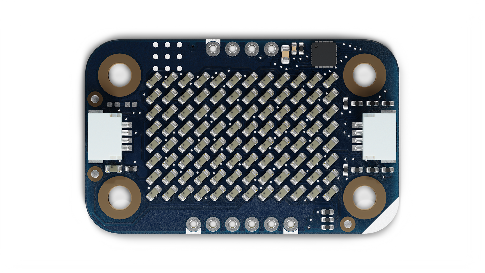
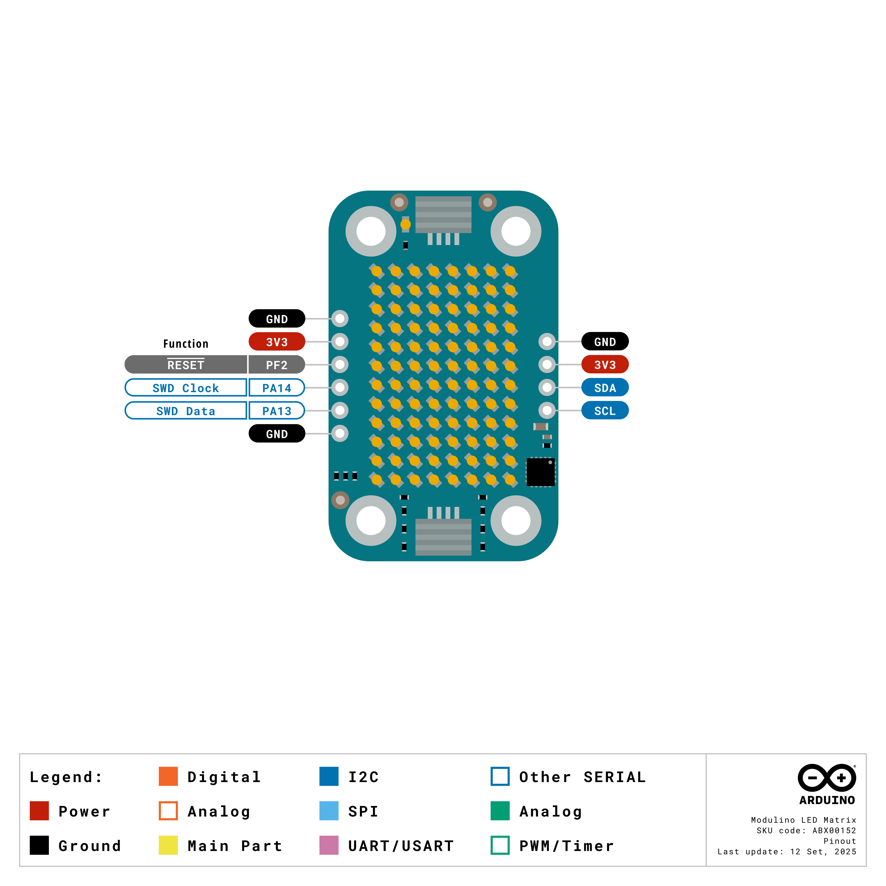

The Modulino LED Matrix is a modular display featuring an 8×12 LED matrix (96 LEDs total) for displaying text, graphics, and animations, making it perfect to add visual feedback to your projects! It uses the standardised Modulino form factor with QWIIC connectors for easy integration.

## Hardware Overview

### General Characteristics

The Modulino LED Matrix features 96 individually controllable LEDs arranged in an 8×12 matrix:

| Parameter    | Condition | Minimum | Typical | Maximum | Unit |
|--------------|-----------|---------|---------|---------|------|
| Matrix Size  | -         | -       | 8×12    | -       | LEDs |
| Total LEDs   | -         | -       | 96      | -       | -    |
| Resolution   | Rows      | -       | 8       | -       | -    |
| Resolution   | Columns   | -       | 12      | -       | -    |
| Current      | All LEDs  | -       | -       | 200     | mA   |

### Sensor Details

The **Modulino LED Matrix** module uses an 8×12 LED matrix controlled via charlieplexing technology. The LEDs do not have native I²C capabilities. Instead, the matrix is driven by the Modulino's onboard microcontroller (STM32C011F4), which handles the complex timing required for charlieplexing and provides I²C communication.

The display provides the same functionality as the Arduino® UNO R4 WiFi LED matrix, ensuring code compatibility.

One unique feature of this setup is the ability to change the I²C address via software, making it adaptable to different system configurations.

The default I²C address for the **Modulino LED Matrix** module is:

| Modulino I²C Address | Hardware I²C Address | Editable Addresses (HEX)                        |
|----------------------|----------------------|--------------------------------------------------|
| 0x32                 | 0x19                 | Any custom address (via software configuration) |

### Pinout



**Qwiic / I2C (1×4 Header)**
| **Pin** | **Function**              |
|---------|---------------------------|
| GND     | Ground                   |
| 3.3 V    | Power Supply (3.3 V)     |
| SDA     | I2C Data                 |
| SCL     | I2C Clock                |

These pads and the Qwiic connectors share the same I2C bus at 3.3 V.

**Additional 1×6 Header (Debug & Power)**
| **Pin** | **Function**      |
|---------|-------------------|
| GND     | Ground            |
| 3V3     | 3.3 V Power       |
| PF2     | RESET (NRST)      |
| SWCLK   | SWD Clock (PA14)  |
| SWDIO   | SWD Data (PA13)   |
| GND     | Ground            |

**Note:** The LED matrix is controlled by pins PA0, PA1, PA2, PA3, PA4, PA5, PA6, PA7, PA8, PA11, and PA12 using charlieplexing. Due to space constraints on the specialised PCB, only the RESET strap is populated.

### Power Specifications

| Parameter           | Condition        | Typical | Unit |
|---------------------|------------------|---------|------|
| Operating Voltage   | -                | 3.3     | V    |
| Current Consumption | Idle             | ~3.4    | mA   |
| Current Consumption | LEDs Illuminated | Variable| mA   |
| Current Consumption | Peak (All LEDs)  | 200     | mA   |

The module includes a power LED that draws 1 mA and turns on as soon as it is powered.

### Schematic

The Modulino LED Matrix features a specialised 4-layer PCB design for controlling 96 LEDs efficiently.

The main components are the 8×12 LED matrix and the **STM32C011F4** microcontroller (U1), which handles charlieplexing control and I²C communication.

You can connect to the I²C pins (SDA and SCL) using either the **QWIIC connectors** (J1 and J2, this is the recommended method) or the **solderable pins** (J4). The board runs on **3.3V**, which comes from the QWIIC cable or the **3V3 pin** on J4.

There's also a small power LED indicator that lights up when the board is on.

You can grab the full schematic and PCB files from the [Modulino Matrix page](https://docs.arduino.cc/hardware/modulinos/modulino-matrix).

## Programming with Arduino

The Modulino LED Matrix is fully compatible with the Arduino IDE and the official Modulino library. The following examples showcase how to display text, graphics, and animations on your LED matrix.

**Note:** The Modulino library currently provides control via the `ModulinoPixels` class for 8-LED operations. Full 8×12 matrix control will be available in future library updates.

### Prerequisites

- Install the Modulino library via the Arduino IDE Library Manager
- Connect your Modulino LED Matrix via QWIIC or solderable headers

For detailed instructions on setting up your Arduino environment and installing libraries, please refer to the [Getting Started with Modulinos guide](../how-general).

Library repository available [here](https://github.com/arduino-libraries/Arduino_Modulino).

### Basic Example

```arduino
#include <Modulino.h>

ModulinoPixels matrix;

void setup() {
  Modulino.begin();
  matrix.begin();
}

void loop() {
  // Turn on LEDs sequentially with different colours
  for (int i = 0; i < 8; i++) {
    // Set LED with RGB colour and brightness (0-100)
    if (i == 0) matrix.set(i, 255, 0, 0, 50);      // Red
    else if (i == 1) matrix.set(i, 255, 127, 0, 50); // Orange
    else if (i == 2) matrix.set(i, 255, 255, 0, 50); // Yellow
    else if (i == 3) matrix.set(i, 0, 255, 0, 50);   // Green
    else if (i == 4) matrix.set(i, 0, 255, 255, 50); // Cyan
    else if (i == 5) matrix.set(i, 0, 0, 255, 50);   // Blue
    else if (i == 6) matrix.set(i, 128, 0, 255, 50); // Purple
    else if (i == 7) matrix.set(i, 255, 0, 255, 50); // Magenta
    
    // Update the display
    matrix.show();
    delay(200);
  }
  
  delay(1000);
  
  // Clear all LEDs
  matrix.clear();
  matrix.show();
  delay(1000);
}
```

### Key Functions

- `set(index, red, green, blue, brightness)`: Sets LED colour (RGB 0-255, brightness 0-100)
- `set(index, ModulinoColor, brightness)`: Sets LED using ModulinoColor object
- `clear(index)`: Clears a specific LED
- `clear()`: Clears all LEDs
- `show()`: Updates the display with current LED states

### Advanced Example - LED Patterns

```arduino
#include <Modulino.h>

ModulinoPixels matrix;

void setup() {
  Serial.begin(9600);
  Modulino.begin();
  matrix.begin();
  
  Serial.println("LED Matrix Pattern Demo");
}

void loop() {
  // Pattern 1: Knight Rider sweep
  Serial.println("Knight Rider");
  knightRider();
  delay(500);
  
  // Pattern 2: Breathing effect
  Serial.println("Breathing");
  breathingEffect();
  delay(500);
  
  // Pattern 3: Random sparkle
  Serial.println("Sparkle");
  randomSparkle();
  delay(500);
}

void knightRider() {
  // Sweep right
  for (int i = 0; i < 8; i++) {
    matrix.clear();
    matrix.set(i, 255, 0, 0, 80);
    if (i > 0) matrix.set(i - 1, 255, 0, 0, 20);
    matrix.show();
    delay(50);
  }
  
  // Sweep left
  for (int i = 7; i >= 0; i--) {
    matrix.clear();
    matrix.set(i, 255, 0, 0, 80);
    if (i < 7) matrix.set(i + 1, 255, 0, 0, 20);
    matrix.show();
    delay(50);
  }
}

void breathingEffect() {
  // Fade in
  for (int brightness = 0; brightness <= 100; brightness += 5) {
    for (int i = 0; i < 8; i++) {
      matrix.set(i, 0, 100, 255, brightness);
    }
    matrix.show();
    delay(30);
  }
  
  // Fade out
  for (int brightness = 100; brightness >= 0; brightness -= 5) {
    for (int i = 0; i < 8; i++) {
      matrix.set(i, 0, 100, 255, brightness);
    }
    matrix.show();
    delay(30);
  }
}

void randomSparkle() {
  for (int j = 0; j < 20; j++) {
    matrix.clear();
    int randomLED = random(0, 8);
    int randomR = random(0, 256);
    int randomG = random(0, 256);
    int randomB = random(0, 256);
    matrix.set(randomLED, randomR, randomG, randomB, 80);
    matrix.show();
    delay(100);
  }
}
```

### Advanced Feature - Grayscale Display

The Modulino LED Matrix supports **4-bit grayscale rendering**, allowing you to display images and animations with 16 different intensity levels (0-15) per pixel. This feature is perfect for creating smooth gradients, realistic animations, and detailed graphics.

#### Understanding Grayscale Mode

In grayscale mode, each pixel can have a brightness value from 0 (off) to 15 (maximum brightness). The frame data is packed efficiently: each byte contains two pixels (4 bits each).

**Frame Data Format:**
- Total pixels: 96 (8 rows × 12 columns)
- Frame buffer size: 48 bytes (96 pixels ÷ 2 pixels per byte)
- Byte format: `0xAB` where A is the first pixel (0-15), B is the second pixel (0-15)

#### Display Modes

The LED Matrix supports three display modes:

- `DisplayMode::Grayscale` - 4-bit grayscale (16 intensity levels)
- `DisplayMode::MonochromaticHorizontal` - Row-major monochromatic (on/off only)
- `DisplayMode::MonochromaticVertical` - Column-major monochromatic (on/off only)

#### Grayscale Example

```arduino
#include <Modulino_LED_Matrix.h>

ModulinoLEDMatrix matrix;

// Create a gradient pattern (48 bytes = 96 pixels)
// Each byte contains 2 pixels (high nibble, low nibble)
const uint8_t GRADIENT[] = {
  0x01, 0x23, 0x45, 0x67, 0x89, 0xAB, 0xCD, 0xEF,  // Row 1
  0xFE, 0xDC, 0xBA, 0x98, 0x76, 0x54, 0x32, 0x10,  // Row 2
  0x01, 0x23, 0x45, 0x67, 0x89, 0xAB, 0xCD, 0xEF,  // Row 3
  0xFE, 0xDC, 0xBA, 0x98, 0x76, 0x54, 0x32, 0x10,  // Row 4
  0x88, 0x88, 0x88, 0x88, 0x88, 0x88, 0x88, 0x88,  // Row 5 (mid-gray)
  0xFF, 0xFF, 0xFF, 0xFF, 0xFF, 0xFF, 0xFF, 0xFF,  // Row 6 (bright)
  0x00, 0x00, 0x00, 0x00, 0x00, 0x00, 0x00, 0x00,  // Row 7 (off)
  0x0F, 0x0F, 0x0F, 0x0F, 0x0F, 0x0F, 0x0F, 0x0F   // Row 8 (alternating)
};

void setup() {
  Serial.begin(115200);

  // Initialize the LED Matrix
  if (!matrix.begin()) {
    Serial.println("Failed to initialize LED Matrix!");
    while (1);
  }

  Serial.println("Grayscale Display Example");

  // Set display mode to grayscale
  matrix.setMode(DisplayMode::Grayscale);

  // Display the gradient pattern
  matrix.setFrame(GRADIENT);
}

void loop() {
  // Frame persists on display
}
```

#### Grayscale Animation Example

```arduino
#include <Modulino_LED_Matrix.h>

ModulinoLEDMatrix matrix;

// Animation callback
void onAnimationComplete() {
  Serial.println("Animation cycle completed!");
  digitalWrite(LED_BUILTIN, !digitalRead(LED_BUILTIN));
}

void setup() {
  Serial.begin(115200);
  pinMode(LED_BUILTIN, OUTPUT);

  if (!matrix.begin()) {
    Serial.println("Failed to initialize LED Matrix!");
    while (1);
  }

  Serial.println("Grayscale Animation Example");

  // Register completion callback
  matrix.setSequenceDoneCallback(onAnimationComplete);

  // Set grayscale mode
  matrix.setMode(DisplayMode::Grayscale);

  // Load and play your animation sequence
  // matrix.setSequence(YOUR_ANIMATION_DATA);
  // matrix.play(true);  // true = loop animation
}

void loop() {
  // Animation plays automatically
}
```

**Note:** You can create custom grayscale animations using image editing software and convert them to the appropriate format. Each frame should be 48 bytes (96 pixels packed as 4-bit values).

## Programming with MicroPython

The Modulino LED Matrix is fully compatible with MicroPython through the official Modulino MicroPython library. The following examples demonstrate how to create visual displays and animations in your MicroPython projects.

### Prerequisites

- Install the Modulino MicroPython library (see [Getting Started with Modulinos](./how-general) for detailed instructions)
- Ensure Arduino Lab for MicroPython is installed

### Basic Example

```python
from modulino import ModulinoPixels
from time import sleep

matrix = ModulinoPixels()

# Define rainbow colours
colours = [
    (255, 0, 0),     # Red
    (255, 127, 0),   # Orange
    (255, 255, 0),   # Yellow
    (0, 255, 0),     # Green
    (0, 255, 255),   # Cyan
    (0, 0, 255),     # Blue
    (128, 0, 255),   # Purple
    (255, 0, 255)    # Magenta
]

while True:
    # Display rainbow
    for i in range(8):
        r, g, b = colours[i]
        matrix.set_led(i, r, g, b, brightness=50)
    matrix.show()
    sleep(1)
    
    # Clear display
    matrix.clear()
    matrix.show()
    sleep(1)
```

### Key Methods

- `.set_led(index, r, g, b, brightness=50)`: Sets LED colour (RGB 0-255, brightness 0-100)
- `.clear()`: Clears all LEDs
- `.show()`: Updates the display with current LED states

### Advanced Example - Animation

```python
from modulino import ModulinoPixels
from time import sleep

matrix = ModulinoPixels()

def knight_rider():
    """Knight Rider sweep animation"""
    # Sweep right
    for i in range(8):
        matrix.clear()
        matrix.set_led(i, 255, 0, 0, brightness=80)
        if i > 0:
            matrix.set_led(i - 1, 255, 0, 0, brightness=20)
        matrix.show()
        sleep(0.05)
    
    # Sweep left
    for i in range(7, -1, -1):
        matrix.clear()
        matrix.set_led(i, 255, 0, 0, brightness=80)
        if i < 7:
            matrix.set_led(i + 1, 255, 0, 0, brightness=20)
        matrix.show()
        sleep(0.05)

def breathing():
    """Breathing effect animation"""
    # Fade in
    for brightness in range(0, 101, 5):
        for i in range(8):
            matrix.set_led(i, 0, 100, 255, brightness=brightness)
        matrix.show()
        sleep(0.03)
    
    # Fade out
    for brightness in range(100, -1, -5):
        for i in range(8):
            matrix.set_led(i, 0, 100, 255, brightness=brightness)
        matrix.show()
        sleep(0.03)

print("💡 LED Matrix Animation Demo")

while True:
    print("Knight Rider")
    knight_rider()
    
    print("Breathing")
    breathing()
    
    sleep(0.5)
```

## API Reference

This section provides a comprehensive reference for all Modulino Matrix-specific functions and methods available in both Arduino and MicroPython.

### Arduino API (ModulinoLEDMatrix)

The `ModulinoLEDMatrix` class provides full control over the 8×12 LED matrix with support for grayscale rendering, animations, and text display.

#### Initialization

**`bool begin()`**

Initializes the LED Matrix module and establishes I²C communication.

- **Returns:** `true` if initialization succeeds, `false` otherwise
- **Example:**
  ```arduino
  ModulinoLEDMatrix matrix;
  if (!matrix.begin()) {
    Serial.println("Failed to initialize!");
  }
  ```

---

#### Display Modes

**`void setMode(DisplayMode mode)`**

Sets the display rendering mode for the LED matrix.

- **Parameters:**
  - `mode` - Display mode to use:
    - `DisplayMode::Grayscale` - 4-bit grayscale (16 intensity levels per pixel)
    - `DisplayMode::MonochromaticHorizontal` - Row-major monochromatic (on/off only)
    - `DisplayMode::MonochromaticVertical` - Column-major monochromatic (on/off only)
- **Example:**
  ```arduino
  matrix.setMode(DisplayMode::Grayscale);
  ```

---

#### Frame Control

**`void setFrame(const uint8_t* frameData)`**

Displays a single static frame on the LED matrix. Frame format depends on the current display mode.

- **Parameters:**
  - `frameData` - Pointer to frame buffer:
    - **Grayscale mode:** 48 bytes (2 pixels per byte, 4 bits each)
    - **Monochromatic mode:** 12 bytes (8 bits per byte)
- **Example:**
  ```arduino
  const uint8_t PATTERN[] = { 0x0F, 0xF0, 0x0F, ... }; // 48 bytes
  matrix.setFrame(PATTERN);
  ```

**`void clear()`**

Clears all pixels on the LED matrix, turning them off.

- **Example:**
  ```arduino
  matrix.clear();
  ```

---

#### Animation Control

**`void setSequence(const uint32_t(*frames)[4])`**

Loads a predefined animation sequence in 32-bit frame format (monochromatic).

- **Parameters:**
  - `frames` - Pointer to array of frames, where each frame is 4 × 32-bit values
- **Example:**
  ```arduino
  const uint32_t ANIMATION[][4] = {
    {0x00000000, 0x00000000, 0x00000000, 0x00000000},
    {0xFFFFFFFF, 0xFFFFFFFF, 0xFFFFFFFF, 0xFFFFFFFF}
  };
  matrix.setSequence(ANIMATION);
  ```

**`void setSequence(const uint8_t* sequenceData, uint32_t sizeBytes)`**

Loads a custom animation sequence with explicit byte size. Supports both grayscale and monochromatic animations.

- **Parameters:**
  - `sequenceData` - Pointer to animation data buffer
  - `sizeBytes` - Total size of animation data in bytes
- **Example:**
  ```arduino
  extern const uint8_t FLAMES[];  // Your animation data
  matrix.setSequence(FLAMES, sizeof(FLAMES));
  ```

**`void play(bool loop = false)`**

Starts playback of the loaded animation sequence.

- **Parameters:**
  - `loop` - If `true`, animation repeats continuously; if `false`, plays once
- **Example:**
  ```arduino
  matrix.play(true);  // Loop animation
  ```

**`void nextFrame()`**

Advances the animation to the next frame manually (useful for frame-by-frame control).

- **Example:**
  ```arduino
  matrix.nextFrame();
  ```

**`void renderFrame(uint32_t frameIndex)`**

Displays a specific frame from the loaded animation sequence by index.

- **Parameters:**
  - `frameIndex` - Zero-based index of the frame to display
- **Example:**
  ```arduino
  matrix.renderFrame(5);  // Display 6th frame
  ```

---

#### Animation Information

**`uint32_t getFrameCount()`**

Returns the total number of frames in the currently loaded animation sequence.

- **Returns:** Number of frames
- **Example:**
  ```arduino
  uint32_t totalFrames = matrix.getFrameCount();
  Serial.println(totalFrames);
  ```

**`uint32_t getCurrentDuration()`**

Returns the duration (in milliseconds) of the currently displayed frame.

- **Returns:** Frame duration in ms
- **Example:**
  ```arduino
  uint32_t frameDuration = matrix.getCurrentDuration();
  ```

---

#### Callbacks

**`void setSequenceDoneCallback(void (*callback)())`**

Registers a callback function that executes when an animation sequence completes.

- **Parameters:**
  - `callback` - Function pointer to execute on completion
- **Example:**
  ```arduino
  void onAnimationComplete() {
    Serial.println("Animation finished!");
  }

  void setup() {
    matrix.setSequenceDoneCallback(onAnimationComplete);
  }
  ```

---

#### Text Rendering (ArduinoGraphics Integration)

**`void textScrollSpeed(unsigned long speed)`**

Sets the scrolling speed for text animations.

- **Parameters:**
  - `speed` - Scroll speed in milliseconds per step
- **Example:**
  ```arduino
  matrix.textScrollSpeed(100);  // 100ms per scroll step
  ```

**`void textFont(const Font& font)`**

Sets the font to use for text rendering.

- **Parameters:**
  - `font` - Font object from ArduinoGraphics library
- **Example:**
  ```arduino
  #include <ArduinoGraphics.h>
  matrix.textFont(Font_5x7);
  ```

**`void beginText(int x, int y, uint32_t color)`**

Begins text rendering at specified coordinates with color.

- **Parameters:**
  - `x` - Starting X coordinate
  - `y` - Starting Y coordinate
  - `color` - Text color (RGB packed in 32-bit format)
- **Example:**
  ```arduino
  matrix.beginText(0, 0, 0xFFFFFF);  // White text at (0,0)
  ```

**`void endText(uint8_t scrollDirection)`**

Completes text rendering and starts scrolling animation.

- **Parameters:**
  - `scrollDirection` - Direction constant (e.g., `SCROLL_LEFT`, `SCROLL_RIGHT`)
- **Example:**
  ```arduino
  matrix.beginText(0, 0, 0xFFFFFF);
  matrix.print("Hello!");
  matrix.endText(SCROLL_LEFT);
  ```

**`void endTextAnimation(uint8_t direction, uint8_t* buffer, uint32_t& usedBytes)`**

Completes text rendering and captures the animation data to a buffer.

- **Parameters:**
  - `direction` - Scroll direction
  - `buffer` - Pointer to output buffer for animation data
  - `usedBytes` - Reference to variable that will receive bytes written
- **Example:**
  ```arduino
  uint8_t animBuffer[1024];
  uint32_t bytesUsed;
  matrix.endTextAnimation(SCROLL_LEFT, animBuffer, bytesUsed);
  ```

---

### Arduino API (ModulinoPixels)

The `ModulinoPixels` class provides control over individual LEDs with RGB color support (legacy API for 8-LED control).

#### Basic LED Control

**`void set(int index, uint8_t red, uint8_t green, uint8_t blue, uint8_t brightness)`**

Sets the color and brightness of a specific LED.

- **Parameters:**
  - `index` - LED index (0-7)
  - `red` - Red component (0-255)
  - `green` - Green component (0-255)
  - `blue` - Blue component (0-255)
  - `brightness` - Brightness level (0-100)
- **Example:**
  ```arduino
  matrix.set(0, 255, 0, 0, 50);  // Red LED at 50% brightness
  ```

**`void set(int index, ModulinoColor color, uint8_t brightness)`**

Sets LED using a ModulinoColor object.

- **Parameters:**
  - `index` - LED index (0-7)
  - `color` - ModulinoColor object
  - `brightness` - Brightness level (0-100)
- **Example:**
  ```arduino
  ModulinoColor red(255, 0, 0);
  matrix.set(0, red, 50);
  ```

**`void clear(int index)`**

Clears (turns off) a specific LED.

- **Parameters:**
  - `index` - LED index to clear (0-7)
- **Example:**
  ```arduino
  matrix.clear(3);  // Turn off LED 3
  ```

**`void clear()`**

Clears all LEDs.

- **Example:**
  ```arduino
  matrix.clear();
  ```

**`void show()`**

Updates the physical display with the current LED states. Must be called after setting LED values.

- **Example:**
  ```arduino
  matrix.set(0, 255, 0, 0, 50);
  matrix.show();  // Apply changes
  ```

---

### MicroPython API

The MicroPython API provides similar functionality through the `ModulinoPixels` class.

**`ModulinoPixels()`**

Constructor for creating a ModulinoPixels instance.

- **Example:**
  ```python
  from modulino import ModulinoPixels
  matrix = ModulinoPixels()
  ```

**`set_led(index, r, g, b, brightness=50)`**

Sets LED color and brightness.

- **Parameters:**
  - `index` - LED index (0-7)
  - `r` - Red component (0-255)
  - `g` - Green component (0-255)
  - `b` - Blue component (0-255)
  - `brightness` - Brightness level (0-100), default 50
- **Example:**
  ```python
  matrix.set_led(0, 255, 0, 0, brightness=80)
  ```

**`clear()`**

Clears all LEDs.

- **Example:**
  ```python
  matrix.clear()
  ```

**`show()`**

Updates the display with current LED states.

- **Example:**
  ```python
  matrix.set_led(0, 0, 255, 0, brightness=60)
  matrix.show()
  ```

---

### Usage Notes

- Always call `show()` (Arduino/MicroPython) after setting LED values to apply changes
- For grayscale animations, frame data must match the 48-byte format (96 pixels, 4 bits each)
- The `ModulinoLEDMatrix` class provides full matrix control, while `ModulinoPixels` currently supports 8-LED operations
- Animation sequences can be created with external tools and included as header files
- When using callbacks, keep callback functions short to avoid blocking animation playback

## Troubleshooting

### Sensor Not Reachable

If your Modulino's power LED isn't on or the sensor isn't responsive:
- Ensure both the board and the Modulino are connected to your computer
- Verify that the power LEDs on both are lit
- Check that the QWIIC cable is properly clicked into place

### LEDs Not Lighting

If the LEDs don't illuminate:
- Ensure you're calling `.show()` after setting LED values
- Check that brightness is set to a visible level (> 0)
- Verify your power supply can handle the current draw

### Library Issues

See the [Getting Started with Modulinos](./how-general) guide for library installation troubleshooting.

## Project Ideas

Now that you've learned how to use your Modulino LED Matrix, try these projects:

- **Status Display**: Show system status with colour-coded indicators
- **Progress Bar**: Visualise completion of tasks or loading processes
- **Music Visualiser**: Create light shows that respond to audio input
- **Game Display**: Build simple LED-based games
- **Notification Centre**: Display alerts with different colour patterns
- **Temperature Indicator**: Show temperature ranges with colour gradients
- **Traffic Light System**: Create multi-state indicators
- **Binary Clock**: Display time in a unique LED pattern
