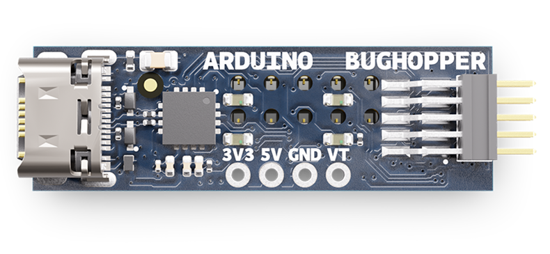
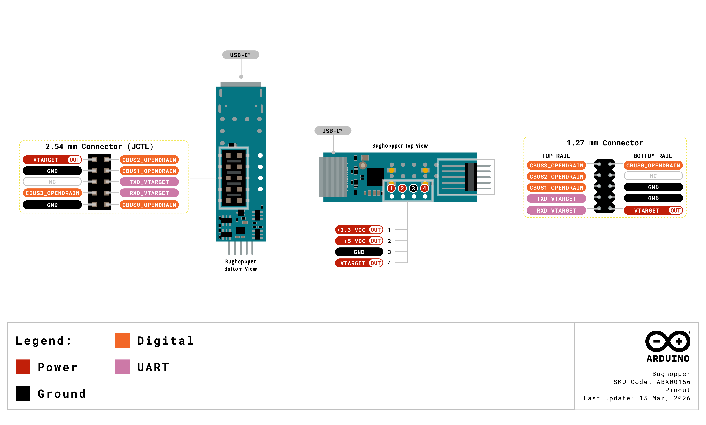
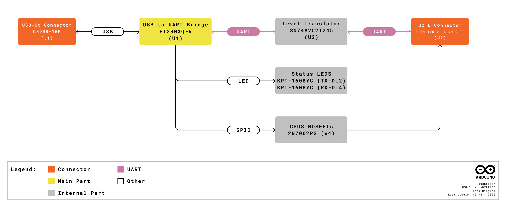
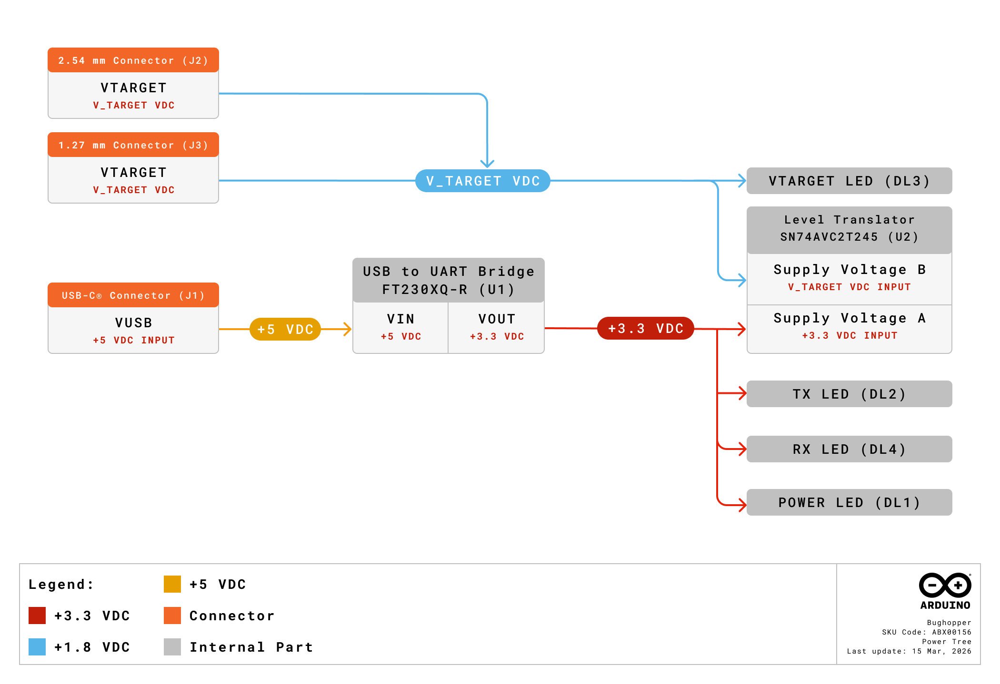
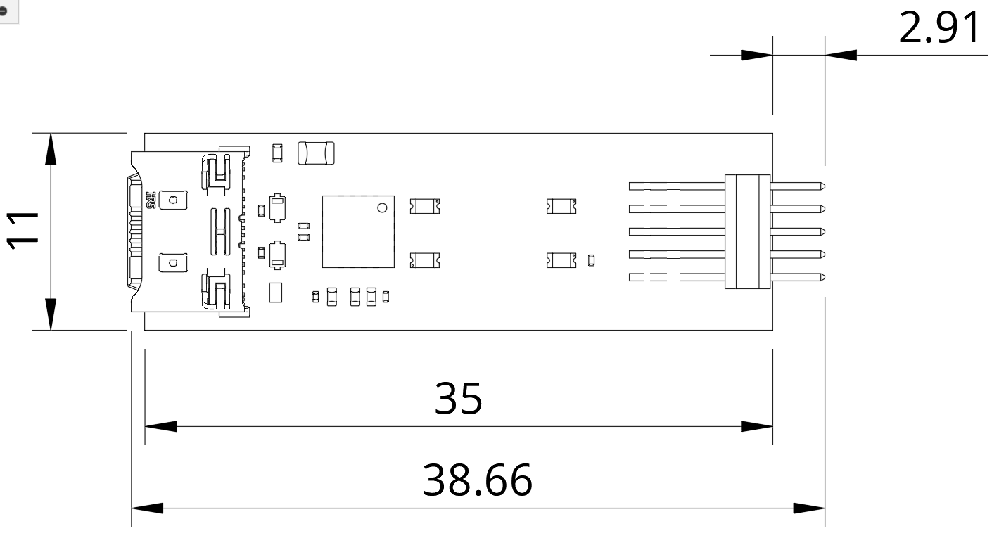
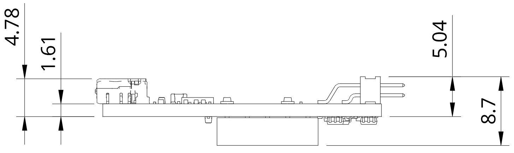
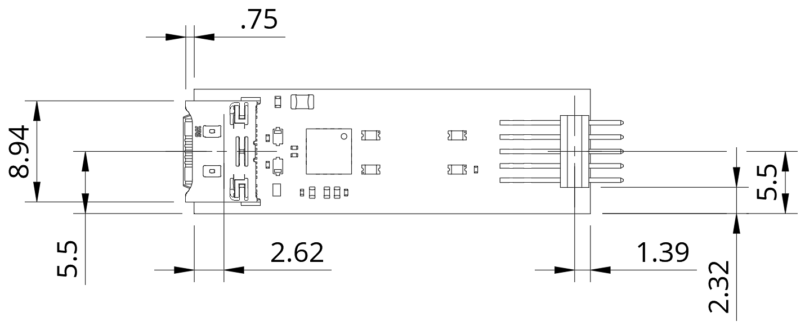
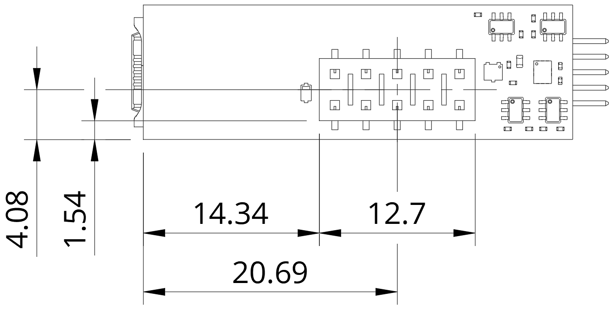
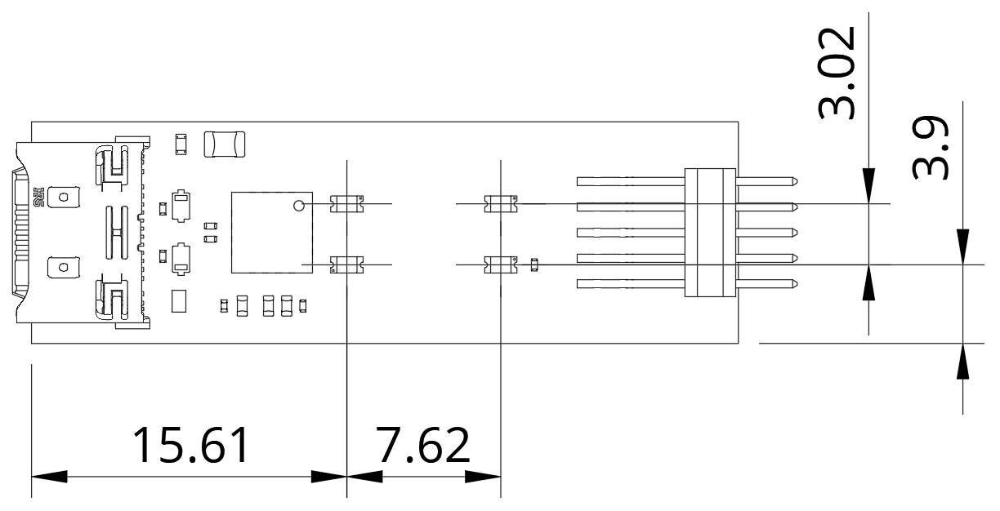

# Description

The Arduino Bughopper is a compact USB-to-UART bridge board designed to bring straightforward remote debugging via its JCTL 2.54 mm connector. Built around the FT230XQ, the Bughopper provides a reliable, high-speed serial link between your development machine and the target board, enabling advanced debugging and logging without occupying the board's main I/O pins. Its compact 38.5 × 11 mm footprint, USB-C® connectivity, and multiple header options make it easy to integrate into any workspace, enclosure, or automated test setup.

# Target Areas:

Embedded development, hardware testing, education

# CONTENTS

## Application Examples

The Arduino Bughopper, when connected to an Arduino UNO Q board or an Arduino VENTUNO Q, provides a dedicated debugging and serial communication channel for various development scenarios. Below are some application examples that demonstrate its practical value:

- **Embedded development and debugging**: The Bughopper streamlines the firmware development workflow by providing a dedicated debug serial channel that does not interfere with the UNO Q's main I/O pins.
  - 
<strong>Remote debug over serial</strong>: Connect the Bughopper to the target board's JCTL 2.54 mm connector to establish a dedicated UART link for real-time debugging. Developers can open the Linux console, monitor serial output, send debug commands, and inspect firmware behavior directly from their development machine via USB-C, all without occupying the UNO Q's primary serial port or I/O headers.

  - 
<strong>Firmware flashing and continuous UART logging</strong>: Use the Bughopper as a persistent serial interface for firmware updates and continuous data logging during long-running tests. Its reliable USB-to-UART bridge (FT230XQ) ensures stable communication at data rates from 300 baud to 3 Mbaud, making it suitable for both routine flashing and high-throughput logging scenarios.

  - 
<strong>Research and development (R&D) and testing</strong>: The Bughopper enables R&D teams and test engineers to integrate reliable debug access into their prototyping and validation workflows.

  - 
<strong>Field diagnostics and automated test</strong>: Install the Bughopper into automated testing rigs to provide consistent, hands-free serial access to UNO Q boards. Its compact form factor and dual header options (2.54 mm female and 1.27 mm male) allow integration into custom test fixtures, enabling field diagnostics and continuous integration pipelines for hardware and software validation.

  - 
<strong>Education and training labs</strong>: The Bughopper offers a low-cost, student-friendly tool for teaching serial communication protocols and hardware debugging fundamentals.

  - 
<strong>Teaching UART communication and debugging workflows</strong>: Institutions teaching embedded systems, Internet of Things (IoT) development, or hardware debugging can use the Bughopper with UNO Q boards to provide hands-on lab exercises. Students learn serial communication protocols, debugging techniques, and project troubleshooting using a modern USB-C interface with clear power status LEDs for quick visual feedback.

## Features

### General Specifications Overview

The Arduino Bughopper is a compact USB-to-UART bridge board built around the FT230XQ from FTDI. Designed for the Arduino UNO Q and the Arduino VENTUNO Q, it connects via the JCTL 2.54 mm connector to provide a dedicated debug and serial communication channel that does not interfere with the board's main I/O.

The main features of the Bughopper are highlighted in the table shown below.

|         **Feature**        | **Description**                                                                                                                                                  |
|:--------------------------:|------------------------------------------------------------------------------------------------------------------------------------------------------------------|
|     USB-to-UART Bridge     | FTDI FT230XQ-R, USB 2.0 Full Speed, data rates from 300 baud to 3 Mbaud                                                                                          |
|        USB Connector       | USB-C for modern, reversible connections                                                                                                                         |
|      Level Translator      | Bidirectional voltage-level translator (SN74AVC2T245RSWR) for safe UART communication between +3.3 VDC and VTARGET domains                            |
|       ESD Protection       | Onboard electrostatic discharge protection on USB (ESD321DYAR) and signal (STN1010SB301) lines                                                                   |
|      Header Connectors     | Female 2.54 mm 2×5 header for connection to UNO Q and the VENTUNO Q JCTL header; male 1.27 mm 2×5 header (FTSH-105-01-L-DH-C-TR) for compact ribbon cable setups |
|    Auxiliary GPIO Lines    | Configurable CBUS outputs (x4, via 2N7002PS MOSFETs)                                                                                                             |
|        Onboard LEDs        | Green (+3.3 VDC power), red (VTARGET status), yellow (x2, TXD and RXD activity)                                                                       |
|        Power Supply        | +5 VDC via USB-C; +3.3 VDC generated by the FT230XQ internal voltage regulator                                                                                   |
| Target Board Compatibility | UNO Q and VENTUNO Q (via JCTL 2.54 mm connector)                                                                                                                 |
|         Dimensions         | 38.5 mm × 11 mm                                                                                                                                                  |

### Related Products

- Arduino® UNO™ Q 2GB (SKU: ABX00162)
- Arduino® UNO™ Q 4GB (SKU: ABX00173)
- Arduino® VENTUNO™ Q 4GB (SKU: ABX00181)

## Ratings

### Recommended Operating Conditions

The table below provides a comprehensive guideline for the optimal use of the Arduino Bughopper, outlining typical operating conditions and design limits. The operating conditions of the Bughopper are largely based on the specifications of the FT230XQ USB-to-UART bridge and the board's level translator (SN74AVC2T245RSWR).

|        **Parameter**        |     **Symbol**     | **Min** | **Typ** | **Max** | **Unit** |
|:---------------------------:|:------------------:|:-------:|:-------:|:-------:|:--------:|
|      USB Supply Voltage     |   VUSB  |   4.75  |   5.0   |   5.25  |     V    |
|    FT230XQ Supply Voltage   |         VCC        |   2.97  |   5.0   |   5.5   |     V    |
| Internal LDO Output Voltage | V3V3OUT |   2.97  |   3.3   |   3.63  |     V    |
|  Target Voltage1 | VTARGET |   1.2   |    -    |   3.6   |     V    |
|    Operating Temperature    |   TOP   |   -40   |    -    |    85   |    °C    |
|  Operating Current (Active) |   IOP   |    -    |    8    |    -    |    mA    |
|     USB Suspend Current     |  ISUSP  |    -    |   125   |    -    |    µA    |

1 VTARGET is a voltage input to the Bughopper supplied by the connected target board through the JCTL 2.54 mm connector. The Bughopper uses this voltage as the reference for the level translator (target side) and the VTARGET status LED. The actual VTARGET value depends on the connected board.

<strong>Driver Tip:</strong> The Bughopper uses the FT230XQ from FTDI, which is supported by FTDI's royalty-free <strong>Virtual Com Port (VCP)</strong> and <strong>Direct (D2XX)</strong> drivers. These drivers are <a href="https://ftdichip.com/drivers/vcp-drivers/" target="_blank" style="color: #0056b3; text-decoration: underline;"> available for Windows, macOS, and Linux</a>, and enable the board to appear as a standard serial COM port on your development machine.

<strong>Safety Note:</strong> The Bughopper is powered exclusively through its USB-C connector. <strong>Do not attempt to supply external power through the header connector pins</strong>. Ensure that the JCTL 2.54 mm connector is properly aligned before connecting the Bughopper to the target board to prevent damage to both boards.

## Functional Overview

The core of the Arduino Bughopper is the FT230XQ USB-to-UART bridge from FTDI. The board receives +5 VDC power from the USB-C connector and generates +3.3 VDC through the FT230XQ's internal voltage regulator. UART signals (TXD and RXD) are routed through a bidirectional level translator (SN74AVC2T245RSWR), which ensures safe voltage-level translation between the +3.3 VDC domain of the FT230XQ and the VTARGET domain of the connected target board. VTARGET is a voltage input to the Bughopper provided by the target board through the JCTL 2.54 mm connector; refer to the target board's documentation for its specific VTARGET value. The Bughopper is compatible with the UNO Q and the Arduino VENTUNO Q. Four onboard LEDs provide visual status: a green LED for the +3.3 VDC power rail, a red LED for the VTARGET rail, and two yellow LEDs for TXD and RXD activity.

### Pinout

The Bughopper connectors pinout is shown in the figure below.

</img>

### Block Diagram

An overview of the high-level architecture of the Arduino Bughopper is illustrated in the figure below.

</img>

The Bughopper's architecture can be summarized in the following functional blocks:

- 
<strong>USB-C connector</strong>: Provides the physical USB interface to the host development machine. Includes ESD protection (ESD321DYAR) on the data lines and a TVS diode (STN1010SB301) on VBUS.

- 
<strong>FTDI FT230XQ</strong>: The main IC of the board. It handles the entire USB protocol, converts USB data to UART signals (TXD, RXD), generates +3.3 VDC via its internal voltage regulator, and provides four configurable GPIOs.

- 
<strong>Level translator (SN74AVC2T245RSWR)</strong>: Performs bidirectional voltage-level translation between the FT230XQ's +3.3 VDC UART signals and the VTARGET domain (from +1.2 to +3.6 VDC) of the connected target board, ensuring safe communication across different voltage levels. VTARGET is supplied by the target board through the JCTL 2.54 mm connector.
- 
<strong>Auxiliary  FT230XQ's GPIO Lines (x4, via 2N7002PS MOSFETs)</strong>: The FT230XQ's CBUS0, CBUS1, CBUS2 and CBUS3 outputs are converted into open-drain signals via x4 2N7002PS MOSFETs , allowing to control four signals of the target board preventing back-powering.

- 
<strong>Status LEDs</strong>: Four LEDs provide at-a-glance status: green (+3.3 VDC power), red (VTARGET), and two yellow (TXD and RXD activity).

### Power Supply

The Arduino Bughopper is powered through its USB-C connector:

</img>

- 
<strong>USB-C connector (+5 VDC)</strong>: The primary and only power input. When connected to a USB host (development machine), the board receives +5 VDC through VBUS. This voltage powers the FT230XQ's VCC pin directly.

- 
<strong>Internal +3.3 VDC LDO (FT230XQ-R V3V3OUT)</strong>: The FT230XQ-R generates +3.3 VDC from the +5 VDC USB supply using its integrated LDO regulator. This regulated output powers the FT230XQ and the level translator's host side.

<strong>Power Tip:</strong> The Bughopper draws approximately 8 mA during active operation and approximately 125 µA during USB suspend, making it suitable for always-connected debug setups with minimal power overhead.

<strong>Safety Note:</strong> Do not attempt to power the Bughopper through any pin other than the USB-C connector.

## Device Operation

### Getting Started - Arduino App Lab

The Arduino UNO Q and the Arduino VENTUNO Q are programmed through Arduino App Lab <strong>[1]</strong>, a unified editor that builds and runs projects on the board's dual-processor architectures: a Linux system (Qualcomm Dragonwing™ QRB2210 for the UNO Q and Qualcomm Dragonwing™ IQ8 for the VENTUNO Q) and a microcontroller (STM32U585 for the UNO Q and STM32H5 for the VENTUNO Q). The Arduino Bughopper complements this workflow by providing an independent serial debug channel through the target board JCTL 2.54 mm connector, accessible from any serial terminal application on your development machine.

To set up the Bughopper with the UNO Q or the VENTUNO Q:

1. 
Connect the Bughopper to the target board JCTL 2.54 mm connector.

2. 
Connect the Bughopper to your development machine using a USB-C data cable.

3. 
The board will appear as a standard serial COM port on your system thanks to FTDI's Virtual Com Port (VCP) drivers.

4. 
Open a serial terminal application (such as the Arduino IDE Serial Monitor, PuTTY, or any other terminal emulator) and select the Bughopper's COM port.

<strong>Note:</strong> The Bughopper provides a serial channel that is <strong>separate</strong> from the target board's main USB-C connection. This means you can monitor debug output through the Bughopper while Arduino App Lab communicates with the target board through its own USB-C or network connection, without any interference between the two channels.

### FTDI Drivers

The Bughopper uses the FTDI FT230XQ, which requires FTDI's VCP (Virtual Com Port) or D2XX drivers to be installed on your development machine. These drivers are <a href="https://ftdichip.com/drivers/vcp-drivers/" target="_blank" style="color: #0056b3; text-decoration: underline;"> available for Windows, macOS, and Linux</a>, and enable the board to appear as a standard serial COM port on your development machine <strong>[3]</strong>. Most modern operating systems include built-in FTDI driver support.

### Online Resources

Explore community projects on Arduino Project Hub <strong>[5]</strong>, browse the Arduino Library Reference <strong>[6]</strong> for supported libraries, and find accessories such as Modulino nodes in the Arduino Store <strong>[7]</strong>.

## Mechanical Information

The Arduino Bughopper is a compact, double-sided board with a USB-C connector on one end, a female 2.54 mm 2×5 header (J2) on the opposite end, and a male 1.27 mm 2×5 header (J3) adjacent to it. The PCB body measures 35 mm × 11 mm; the overall board dimension, including the J3 1.27 mm header overhang, is 38.5 mm × 11 mm. The board's narrow form factor is designed for easy integration into workspaces, enclosures, and automated test fixtures.

### Board Dimensions

The Bughopper board outline is shown in the figure below; <strong>all the dimensions are in mm</strong>.

</img>

</img>

### Board Connectors

The Bughopper features three connectors: a USB-C connector on one end for host communication and power, a female 2.54 mm 2×5 header or direct connection to JCTL header of the target board, and a male 1.27 mm 2×5 header (FTSH-105-01-L-DH-C-TR) for compact ribbon cable connections. The placement of these connectors is shown in the figure below; <strong>all the dimensions are in mm</strong>.

</img>

</img>

### Board Peripherals and Actuators

The Bughopper has four onboard LEDs that provide visual status feedback. A green LED indicates the +3.3 VDC power rail status, a red LED indicates the VTARGET rail status, and two yellow LEDs indicate TXD and RXD serial activity, respectively. The placement of these LEDs is shown in the figure below; <strong>all the dimensions are in mm</strong>.

</img>

## Product Compliance

### Product Compliance Summary

| **Product Compliance** |
|:----------------------:|
|  CE (European Union)   |
|          RoHS          |
|         REACH          |
|          WEEE          |

### Declaration of Conformity CE DoC (EU)

We declare under our sole responsibility that the products above are in conformity with the essential requirements of the following EU Directives and therefore qualify for free movement within markets comprising the European Union (EU) and European Economic Area (EEA).

### Declaration of Conformity to EU RoHS & REACH 211 01/19/2021

Arduino boards are in compliance with RoHS 2 Directive 2011/65/EU of the European Parliament and RoHS 3 Directive 2015/863/EU of the Council of 4 June 2015 on the restriction of the use of certain hazardous substances in electrical and electronic equipment.

| **Substance**                          | **Maximum Limit (ppm)** |
|----------------------------------------|-------------------------|
| Lead (Pb)                              | 1000                    |
| Cadmium (Cd)                           | 100                     |
| Mercury (Hg)                           | 1000                    |
| Hexavalent Chromium (Cr6+)             | 1000                    |
| Poly Brominated Biphenyls (PBB)        | 1000                    |
| Poly Brominated Diphenyl ethers (PBDE) | 1000                    |
| Bis(2-Ethylhexyl) phthalate (DEHP)     | 1000                    |
| Benzyl butyl phthalate (BBP)           | 1000                    |
| Dibutyl phthalate (DBP)               | 1000                    |
| Diisobutyl phthalate (DIBP)            | 1000                    |

Exemptions: No exemptions are claimed.

Arduino Boards are fully compliant with the related requirements of European Union Regulation (EC) 1907 /2006 concerning the Registration, Evaluation, Authorization and Restriction of Chemicals (REACH). We declare none of the SVHCs (https://echa.europa.eu/web/guest/candidate-list-table), the Candidate List of Substances of Very High Concern for authorization currently released by ECHA, is present in all products (and also package) in quantities totaling in a concentration equal or above 0.1%. To the best of our knowledge, we also declare that our products do not contain any of the substances listed on the "Authorization List" (Annex XIV of the REACH regulations) and Substances of Very High Concern (SVHC) in any significant amounts as specified by the Annex XVII of Candidate list published by ECHA (European Chemical Agency) 1907 /2006/EC.

### Conflict Minerals Declaration

As a global supplier of electronic and electrical components, Arduino is aware of our obligations concerning laws and regulations regarding Conflict Minerals, specifically the Dodd-Frank Wall Street Reform and Consumer Protection Act, Section 1502. Arduino does not directly source or process conflict minerals such as Tin, Tantalum, Tungsten, or Gold. Conflict minerals are contained in our products in the form of solder, or as a component in metal alloys. As part of our reasonable due diligence, Arduino has contacted component suppliers within our supply chain to verify their continued compliance with the regulations. Based on the information received thus far we declare that our products contain Conflict Minerals sourced from conflict-free areas.

## Company Information

| **Company Information** | **Details**                                |
|-------------------------|--------------------------------------------|
| Company Name            | Arduino S.r.l.                             |
| Company Address         | Via Andrea Appiani, 25-20900 Monza (Italy) |

## Reference Documentation
| **No.** | **Reference**           | **Link**                                    |
|:-------:|-------------------------|---------------------------------------------|
|    1    | Arduino App Lab         | https://docs.arduino.cc/software/app-lab/   |
|    2    | UNO Q Documentation     | https://docs.arduino.cc/hardware/uno-q/     |
|    3    | VENTUNO Q Documentation | https://docs.arduino.cc/hardware/ventuno-q/ |
|    4    | FTDI VCP Drivers        | https://ftdichip.com/drivers/vcp-drivers/   |
|    5    | Bughopper Documentation | https://docs.arduino.cc/hardware/bughopper/ |
|    6    | Project Hub             | https://create.arduino.cc/projecthub        |
|    7    | Library Reference       | https://www.arduino.cc/reference/en/        |
|    8    | Arduino Store           | https://store.arduino.cc/                   |

## Document Revision History

|  **Date**  | **Revision** |  **Changes**  |
|:----------:|:------------:|:-------------:|
| 27/03/2026 |       1      | First release |