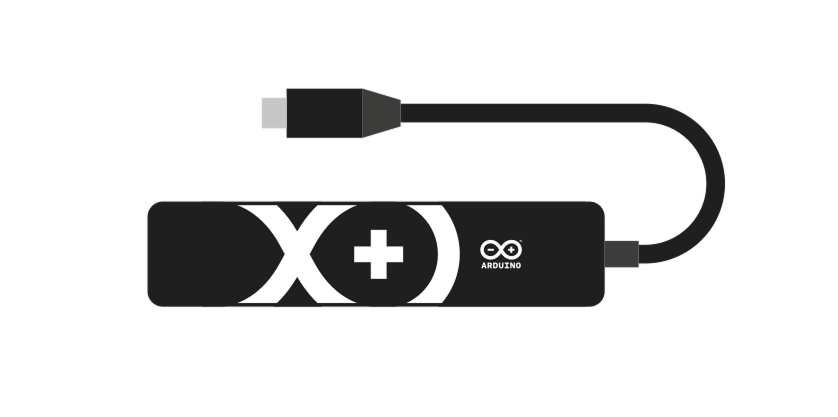
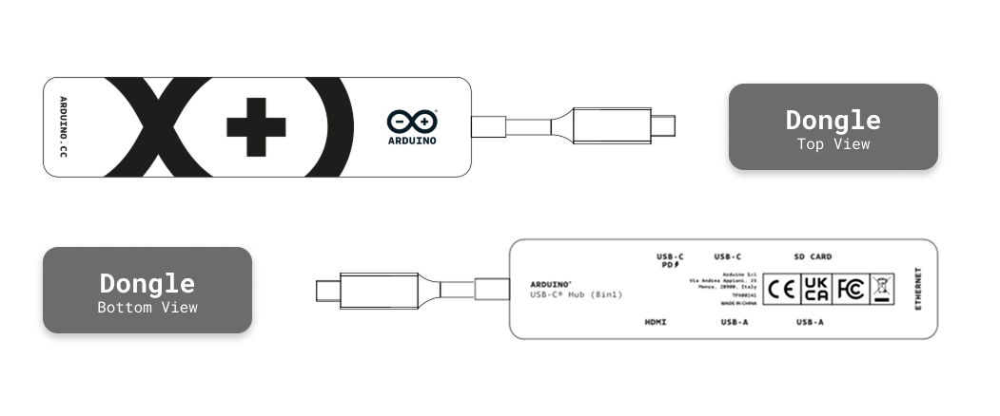
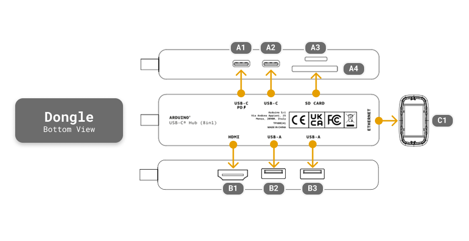

# Description

The Arduino® USB-C Hub (8 in 1) (TPX00241) is a compact multiport adapter designed for use with USB-C devices. This hub expands a single USB-C port into eight functional interfaces, including power delivery, USB data ports, HDMI video output, Ethernet connectivity, and SD/TF card readers. With its plug-and-play design and broad OS compatibility, it provides I/O expansion for development, prototyping, and deployment scenarios.

# CONTENTS

## Features

### General Specifications

| **Feature**        | **Specification**                      |
|--------------------|----------------------------------------|
| Model Number       | TPX00241                               |
| Color              | Black                                  |
| Cable Length       | 175 mm                                 |
| Dimensions         | 119 × 27.8 × 16 mm                     |
| Weight             | 60 g                                   |

### Port Configuration

| **Port Type**                 | **Quantity** | **Specification**                                  |
|-------------------------------|--------------|----------------------------------------------------|
| USB-C PD (Power) (A1)         | 1            | 65 W Power Delivery                                |
| USB-C Data (A2)               | 1            | 480 Mbps                                           |
| USB-A 2.0 (B2)                | 1            | 480 Mbps                                           |
| USB-A 3.0 (B3)                | 1            | 5 Gbps                                             |
| HDMI (B1)                     | 1            | 4K @ 30 Hz (3840 × 2160)                           |
| RJ45 Ethernet (C1)            | 1            | 100 Mbps                                           |
| SD Card Reader (A4)           | 1            | USB 2.0, supports SD/SDHC UHS-I-II / SDXC UHS-I-II |
| TF (microSD) Card Reader (A3) | 1            | Supports microSD/microSDHC UHS-I / microSDXC UHS-I |

### Operating Conditions

| **Parameter**       | **Range**      |
|---------------------|----------------|
| Working Temperature | 0 °C – 50 °C   |
| Storage Temperature | -20 °C – 60 °C |

### Compatibility

| **System** | **Version**          |
|------------|----------------------|
| Windows    | XP / 7 / 8 / 10 / 11 |
| macOS      | 10.2.8 and above     |
| Linux      | Supported            |

  <strong>Note:</strong> This Hub is plug-and-play compatible with most operating systems. No additional drivers are required for basic functionality.

## Usage

The USB-C Hub (8 in 1) expands the connectivity of USB-C devices, providing access to external displays, network connectivity, additional USB peripherals, and storage devices. When used with single-board computers in desktop mode, this hub allows connection of multiple peripherals simultaneously.

### Key Use Cases

- **Display Output:** Connect HDMI monitors or displays for visual output (up to 4K @ 30 Hz)
- **Network Connectivity:** Wired Ethernet connection via RJ45 port (100 Mbps)
- **USB Peripherals:** Attach keyboards, mice, USB drives, cameras, and other USB devices
- **Storage Expansion:** Read and write SD/TF cards for data logging and file transfer
- **Power Delivery:** Supply power to connected devices while simultaneously using other ports (65 W PD)

  <strong>Important:</strong> The hub requires external power delivery through the USB-C PD port. Ensure your power supply provides at least 5 V / 3 A (15 W minimum) for stable operation of connected devices and peripherals. For maximum performance with multiple high-power devices, a 65 W PD charger is recommended.

## Technical Specifications

### Video Output

| **Parameter**         | **Specification**        |
|-----------------------|--------------------------|
| Interface             | HDMI Type-A              |
| Maximum Resolution    | 4K (3840 × 2160) @ 30 Hz |
| Supported Resolutions | 1080p, 720p, 480p        |
| Audio Support         | HDMI audio pass-through  |

### Network

| **Parameter** | **Specification**           |
|---------------|-----------------------------|
| Interface     | RJ45 Ethernet               |
| Speed         | 10/100 Mbps (Fast Ethernet) |

### Card Readers

| **Parameter**    | **SD Card Reader**                   | **TF Card Reader**                            |
|------------------|--------------------------------------|-----------------------------------------------|
| Interface Speed  | USB 2.0 (480 Mbps)                   | USB 2.0 (480 Mbps)                            |
| Supported Cards  | SD, SDHC (UHS-I-II), SDXC (UHS-I-II) | microSD, microSDHC (UHS-I), microSDXC (UHS-I) |
| Maximum Capacity | Up to 2 TB (SDXC)                    | Up to 2 TB (microSDXC)                        |
| LED Indicator    | Not available                        | Not available                                 |

  <strong>Note:</strong> Both card readers can be used simultaneously. Ensure cards are properly formatted (FAT32, exFAT, or NTFS) for compatibility with your operating system.

### Power Delivery

| **Parameter**    | **Specification**            |
|------------------|------------------------------|
| Input Voltage    | 5 V – 20 V (USB PD standard) |
| Maximum Power    | 65 W                         |
| Output to Device | Pass-through                 |

The USB-C PD port supports USB Power Delivery negotiation up to 65 W. The actual power delivered to the connected device depends on the power supply capability and the device's power requirements. When multiple peripherals are connected, ensure the power supply can handle the combined load.

## Mechanical Information

### Dimensions

The hub features a compact form factor suitable for portable use with various devices. The attached cable provides flexibility for connection without blocking adjacent ports.

| **Dimension** | **Measurement** |
|---------------|-----------------|
| Length        | 119 mm          |
| Width         | 27.8 mm         |
| Height        | 16 mm           |
| Cable Length  | 175 mm          |
| Weight        | 60 g            |

### Package Contents

- 1× Arduino® USB-C Hub (8 in 1)

## Certifications

### Declaration of Conformity CE DoC (EU)

English: We declare under our sole responsibility that the products above are in conformity with the essential requirements of the following EU Directives and therefore qualify for free movement within markets comprising the European Union (EU) and European Economic Area (EEA).

French: Nous déclarons sous notre seule responsabilité que les produits indiqués ci-dessus sont conformes aux exigences essentielles des directives de l'Union européenne mentionnées ci-après, et qu'ils remplissent à ce titre les conditions permettant la libre circulation sur les marchés de l'Union européenne (UE) et de l'Espace économique européen (EEE).

### Declaration of Conformity to EU RoHS & REACH

Arduino boards and accessories are in compliance with Directive 2011/65/EU of the European Parliament and Directive 2015/863/EU of the Council of 4 June 2015 on the restriction of the use of certain hazardous substances in electrical and electronic equipment.

| **Substance**                          | **Maximum Limit (ppm)** |
|----------------------------------------|-------------------------|
| Lead (Pb)                              | 1000                    |
| Cadmium (Cd)                           | 100                     |
| Mercury (Hg)                           | 1000                    |
| Hexavalent Chromium (Cr6+)             | 1000                    |
| Poly Brominated Biphenyls (PBB)        | 1000                    |
| Poly Brominated Diphenyl ethers (PBDE) | 1000                    |
| Bis(2-Ethylhexyl) phthalate (DEHP)     | 1000                    |
| Benzyl butyl phthalate (BBP)           | 1000                    |
| Dibutyl phthalate (DBP)                | 1000                    |
| Diisobutyl phthalate (DIBP)            | 1000                    |

Exemptions: No exemptions are claimed.

Arduino products are fully compliant with the related requirements of European Union Regulation (EC) 1907/2006 concerning the Registration, Evaluation, Authorization and Restriction of Chemicals (REACH). We declare none of the SVHCs (https://echa.europa.eu/web/guest/candidate-list-table), the Candidate List of Substances of Very High Concern for authorization currently released by ECHA, is present in all products (and also package) in quantities totaling in a concentration equal or above 0.1%. To the best of our knowledge, we also declare that our products do not contain any of the substances listed on the "Authorization List" (Annex XIV of the REACH regulations) and Substances of Very High Concern (SVHC) in any significant amounts as specified by the Annex XVII of Candidate list published by ECHA (European Chemical Agency) 1907/2006/EC.

### Conflict Minerals Declaration

As a global supplier of electronic and electrical components, Arduino is aware of our obligations with regards to laws and regulations regarding Conflict Minerals, specifically the Dodd-Frank Wall Street Reform and Consumer Protection Act, Section 1502. Arduino does not directly source or process conflict minerals such as Tin, Tantalum, Tungsten, or Gold. Conflict minerals are contained in our products in the form of solder, or as a component in metal alloys. As part of our reasonable due diligence Arduino has contacted component suppliers within our supply chain to verify their continued compliance with the regulations. Based on the information received thus far we declare that our products contain Conflict Minerals sourced from conflict-free areas.

## FCC Caution

Any Changes or modifications not expressly approved by the party responsible for compliance could void the user's authority to operate the equipment.

This device complies with part 15 of the FCC Rules. Operation is subject to the following two conditions:

(1) This device may not cause harmful interference

(2) this device must accept any interference received, including interference that may cause undesired operation.

**FCC RF Radiation Exposure Statement:**

This equipment complies with FCC radiation exposure limits set forth for an uncontrolled environment.

## Company Information

| Company name    | Arduino S.r.l.                             |
|-----------------|--------------------------------------------|
| Company address | Via Andrea Appiani 25, 20900 Monza (Italy) |

## Reference Documentation

| No. | Reference     | Link                                                   |
|:---:|---------------|--------------------------------------------------------|
|  1  | Arduino Store | [https://store.arduino.cc/](https://store.arduino.cc/) |

## Document Revision History

|  **Date**  | **Revision** | **Changes**   |
|:----------:|:------------:|---------------|
| 27/03/2026 |      1       | First release |