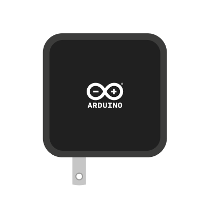
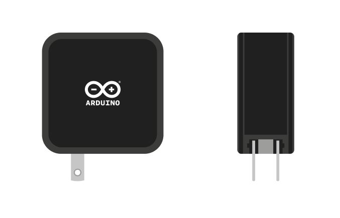
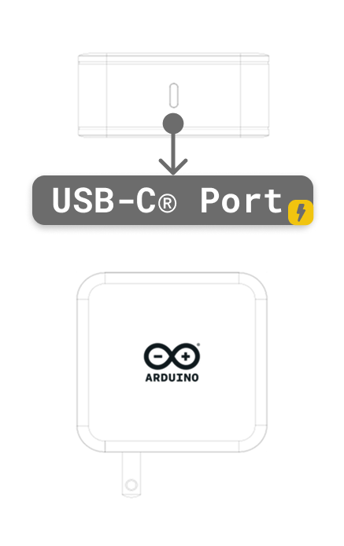
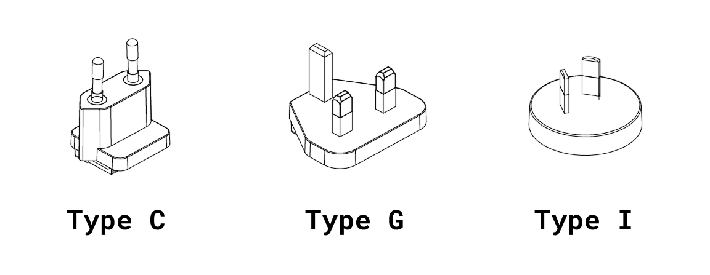

# Description

The Arduino® USB-C Power Supply (TPX00242) is a compact, interchangeable plug adapter designed for use with the Arduino® UNO Q and other USB-C devices supporting USB Power Delivery (PD). This 45W multi-voltage power adapter provides intelligent power delivery across five voltage profiles (5V, 9V, 12V, 15V, 20V), automatically negotiating the optimal charging parameters for connected devices. With interchangeable regional plugs (EU, UK, US) and broad safety certifications, it provides a universal power solution for development, prototyping, and deployment scenarios worldwide.

# CONTENTS

## Features

### General Specifications

| **Feature**         | **Specification**                      |
|---------------------|----------------------------------------|
| Model Number        | TPX00242                               |
| Manufacturer Model  | AS4801A-PD45DK                         |
| Manufacturer        | Lanyue Electronics (Shenzhen) Co., Ltd |
| Adapter Type        | Interchangeable plug-in adapter        |
| Output Connector    | USB-C (USB Type-C)                     |
| Dimensions (Body)   | 64 × 64 × 30 mm (excluding plug)       |
| Weight              | Approximately 90 g (with plug)         |
| Material            | PC (Polycarbonate) housing             |
| Fire Rating         | UL94V-0                                |

### Input Specifications

| **Parameter**         | **Specification**     |
|-----------------------|-----------------------|
| Rated Input Voltage   | 100 - 240 V AC        |
| Input Voltage Range   | 90 - 264 V AC         |
| Input Frequency       | 47 - 63 Hz (50/60 Hz) |
| Maximum Input Current | 1.5 A                 |

### Output Specifications

| **Output Voltage** | **Maximum Current** | **Maximum Power** |
|-------------------:|--------------------:|------------------:|
|           5.0 V DC |               3.0 A |              15 W |
|           9.0 V DC |               3.0 A |              27 W |
|          12.0 V DC |               3.0 A |              36 W |
|          15.0 V DC |               3.0 A |              45 W |
|          20.0 V DC |              2.25 A |              45 W |

**Combined Maximum Output Power:** 45 W

  <strong>Note:</strong> The power supply automatically negotiates the appropriate voltage and current with the connected device using USB Power Delivery (PD) protocol. The device will select the optimal power profile based on its requirements.

### Power Delivery Protocols

| **Protocol** | **Support** |
|--------------|-------------|
| USB PD 3.0   | Supported   |
| PPS          | Supported   |

### Regional Plug Options

| **Region**              | **Plug Type** | **Dimensions**        |
|-------------------------|---------------|-----------------------|
| United States (Default) | Type A        | 18.4 × 27.5 × 8.15 mm |
| Europe (EU)             | Type C        | 24.1 × 19.0 × 8.15 mm |
| United Kingdom          | Type G        | 20.0 × 48.98 × 8.7 mm |
| Australia (AU)          | Type I        | 20.0 × 28.0 × 8.7 mm  |

  <strong>Note:</strong> Plugs are interchangeable and can be replaced without tools. Ensure the correct plug is attached for your region before use.

## Usage with Arduino® UNO Q

The Arduino USB-C Power Supply is specifically designed to provide optimal power delivery for the Arduino® UNO Q board and its peripherals. When used with the USB-C 8-in-1 Dongle, this power supply ensures stable operation of the UNO Q alongside multiple connected peripherals including displays, USB devices, and network adapters.

### Key Use Cases

- **UNO Q Power Supply:** Direct connection to UNO Q USB-C port for development and operation
- **Dongle Power Delivery:** Powers the USB-C 8-in-1 Dongle with sufficient headroom for multiple peripherals
- **Fast Charging:** Charges UNO Q and other USB-C devices with intelligent power negotiation
- **Multi-Device Support:** Compatible with smartphones, tablets, laptops, and other USB-C devices

### Recommended Power Profiles for UNO Q

| **Configuration**                    | **Recommended Profile** | **Power Delivered** |
|--------------------------------------|-------------------------|---------------------|
| UNO Q standalone                     | 5.0 V / 3.0 A           | 15 W                |
| UNO Q + USB-C Dongle (light load)    | 5.0 V / 3.0 A           | 15 W                |
| UNO Q + Dongle + Multiple Peripherals| 5.0 V / 3.0 A           | 15 W                |

  <strong>Important:</strong> When using the USB-C 8-in-1 Dongle with multiple high-power peripherals, ensure the power supply is connected to the dongle's PD port (not directly to the UNO Q). The dongle will pass through power to the UNO Q while simultaneously powering connected peripherals.

### Connection Diagram

For standalone UNO Q operation, connect the power supply's USB-C output directly to the UNO Q's USB-C port. For expanded I/O with the USB-C Dongle, connect the power supply to the dongle's USB-C PD port, then connect the dongle to the UNO Q.

## Technical Specifications

### Output Characteristics

#### Voltage Regulation

| **Output Voltage** | **Voltage Range** | **Regulation** |
|-------------------:|------------------:|----------------|
|              5.0 V |      4.6 - 5.25 V | ±5%            |
|              9.0 V |     8.55 - 9.45 V | ±5%            |
|             12.0 V |     11.4 - 12.6 V | ±5%            |
|             15.0 V |   14.25 - 15.75 V | ±5%            |
|             20.0 V |     19.0 - 21.0 V | ±5%            |

#### Ripple and Noise

| **Parameter**                | **Specification**                |
|------------------------------|----------------------------------|
| Ripple and Noise (all modes) | 150 mVp-p maximum (at full load) |
| Measurement Bandwidth        | 20 MHz                           |

  <strong>Measurement Conditions:</strong> Ripple and noise measurements are performed with a 20 MHz bandwidth-limited oscilloscope, with the output terminated by a parallel combination of 0.1 μF ceramic capacitor and 10 μF electrolytic capacitor.

#### Dynamic Response

| **Parameter** | **Specification**                          |
|---------------|--------------------------------------------|
| Turn-on Delay | 3 seconds maximum @ 115 V AC, full load    |
| Hold-up Time  | 5 ms minimum @ 230 V AC, full load         |
| Rise Time     | 80 ms maximum (10% to 90% of rated output) |

### Efficiency

| **Output Mode** | **Average Efficiency** |
|-----------------|------------------------|
| 5.0 V / 3.0 A   | 81.39% minimum         |
| 9.0 V / 3.0 A   | 86.62% minimum         |
| 12.0 V / 3.0 A  | 87.40% minimum         |
| 15.0 V / 3.0 A  | 87.73% minimum         |
| 20.0 V / 2.25 A | 87.73% minimum         |

**No-Load Power Consumption:** ≤ 0.1 W @ 115-230 V AC

### Protection Features

| **Protection Type**         | **Specification**                                                 |
|-----------------------------|-------------------------------------------------------------------|
| Over Current Protection     | 105% - 150% of maximum load; auto-recovery hiccup mode            |
| Short Circuit Protection    | Output automatically shuts down; auto-recovery when fault removed |
| Over Voltage Protection     | Hiccup protection mode; auto-recovery when fault removed          |
| Over Temperature Protection | Thermal shutdown with auto-recovery                               |

### Operating Conditions

| **Parameter**         | **Range**                     |
|-----------------------|-------------------------------|
| Operating Temperature | 0 °C - 35 °C                  |
| Storage Temperature   | -40 °C - 70 °C                |
| Operating Humidity    | 10% - 90% RH (non-condensing) |
| Storage Humidity      | 5% - 95% RH (non-condensing)  |
| Operating Altitude    | Up to 5000 m                  |
| Storage Altitude      | Up to 5000 m                  |

### Safety and EMC Specifications

#### Electrical Safety

| **Parameter**          | **Specification**                       |
|------------------------|-----------------------------------------|
| Dielectric Strength    | 3000 V AC @ 50 Hz, 5 mA max, 60 seconds |
| Production Hi-Pot Test | 3600 V AC @ 50 Hz, 5 mA max, 3 seconds  |
| Leakage Current        | 0.25 mA maximum @ 230 V AC / 50 Hz      |
| Insulation Resistance  | 10 MΩ minimum @ 500 V DC, 90% RH        |
| Protection Class       | Class II (double insulated)             |

#### EMI/EMC Compliance

| **Standard**        | **Compliance**                                  |
|---------------------|-------------------------------------------------|
| Conducted Emissions | EN55032, FCC Part 15, AS/NZS CISPR32            |
| Radiated Emissions  | EN55032, FCC Part 15                            |
| ESD Immunity        | EN 61000-4-2 (±4 kV contact, ±8 kV air)         |
| EFT/Burst Immunity  | EN 61000-4-4 (±1 kV)                            |
| Surge Immunity      | EN 61000-4-5 (±2 kV common, ±1 kV differential) |

## Mechanical Information

### Dimensions

The power supply features a compact cubic form factor suitable for travel and portable use. The interchangeable plug design allows use in multiple regions without adapters.

| **Component**      | **Dimensions**        |
|--------------------|-----------------------|
| Main Body          | 64 × 64 × 30 mm       |
| EU Plug            | 24.1 × 19.0 × 8.15 mm |
| UK Plug            | 20.0 × 48.98 × 8.7 mm |
| US Plug            | 18.4 × 27.5 × 8.15 mm |
| AU Plug            | 20.0 × 28.0 × 8.7 mm  |
| Weight (with plug) | ~90 g                 |

### Package Contents

- 1× Arduino USB-C Power Supply (45W)
- 1× Interchangeable plug (region-specific: EU, UK, or US)
- 1× User manual
- 1× Retail packaging

  <strong>Note:</strong> Additional regional plugs can be purchased separately. Plugs are easily interchangeable without tools.

## Environmental and Reliability

### Reliability Requirements

| **Parameter**         | **Specification**                                          |
|-----------------------|------------------------------------------------------------|
| MTBF                  | 30,000 hours minimum @ 25°C, 80% load, nominal input       |
| High Temperature Test | Normal operation @ 240 V AC, full load, 35°C ambient       |
| Salt Spray Test       | 24 hours @ 5% salt concentration, no corrosion on contacts |

### Mechanical Stress Tests

#### Vibration Test

- **Frequency Range:** 10 - 300 Hz sweep
- **Acceleration:** 1.0 G constant (3.5 mm displacement)
- **Duration:** 1 hour per axis (X, Y, Z)
- **Criteria:** No visible damage, normal operation after test

#### Drop Test

- **Surfaces:** 6 faces
- **Height:** 1 meter
- **Surface:** Concrete
- **Criteria:** Plugs may bend, housing may scratch, but no structural damage; normal operation after test

### Environmental Compliance

| **Regulation**     |
|--------------------|
| RoHS               |
| REACH              |
| CPSIA              |
| EN71               |
| California Prop 65 |

# Certifications

## Safety Certifications

The Arduino USB-C Power Supply holds the following safety certifications:

| **Certification** | **Region**      | **Standard**              | 
|-------------------|-----------------|---------------------------|
| UL/CUL            | USA/Canada      | UL62368-1, CSA C22.2      |
| ETL               | USA             | UL62368                   |
| TUV/GS            | Europe          | EN62368                   |
| CE                | Europe          | EN62368                   |
| UKCA              | United Kingdom  | EN62368                   |
| FCC               | USA             | Part 15 Class B           |
| SAA               | Australia       | AS/NZS 62368              |
| C-TICK            | Australia       | AS/NZS CISPR32:2015       |

  <strong>Note:</strong> All certifications are maintained and updated regularly. For the most current certification status, please contact Arduino support or refer to product documentation.

## Declaration of Conformity CE DoC (EU)

English: We declare under our sole responsibility that the products above are in conformity with the essential requirements of the following EU Directives and therefore qualify for free movement within markets comprising the European Union (EU) and European Economic Area (EEA).

French: Nous déclarons sous notre seule responsabilité que les produits indiqués ci-dessus sont conformes aux exigences essentielles des directives de l'Union européenne mentionnées ci-après, et qu'ils remplissent à ce titre les conditions permettant la libre circulation sur les marchés de l'Union européenne (UE) et de l'Espace économique européen (EEE).

## Declaration of Conformity to EU RoHS & REACH

Arduino products are in compliance with Directive 2011/65/EU of the European Parliament and Directive 2015/863/EU of the Council of 4 June 2015 on the restriction of the use of certain hazardous substances in electrical and electronic equipment.

| **Substance**                          | **Maximum Limit (ppm)** |
|----------------------------------------|-------------------------|
| Lead (Pb)                              | 1000                    |
| Cadmium (Cd)                           | 100                     |
| Mercury (Hg)                           | 1000                    |
| Hexavalent Chromium (Cr6+)             | 1000                    |
| Poly Brominated Biphenyls (PBB)        | 1000                    |
| Poly Brominated Diphenyl ethers (PBDE) | 1000                    |
| Bis(2-Ethylhexyl) phthalate (DEHP)     | 1000                    |
| Benzyl butyl phthalate (BBP)           | 1000                    |
| Dibutyl phthalate (DBP)                | 1000                    |
| Diisobutyl phthalate (DIBP)            | 1000                    |

Exemptions: No exemptions are claimed.

Arduino products are fully compliant with the related requirements of European Union Regulation (EC) 1907/2006 concerning the Registration, Evaluation, Authorization and Restriction of Chemicals (REACH). We declare none of the SVHCs (https://echa.europa.eu/web/guest/candidate-list-table), the Candidate List of Substances of Very High Concern for authorization currently released by ECHA, is present in all products (and also package) in quantities totaling in a concentration equal or above 0.1%. To the best of our knowledge, we also declare that our products do not contain any of the substances listed on the "Authorization List" (Annex XIV of the REACH regulations) and Substances of Very High Concern (SVHC) in any significant amounts as specified by the Annex XVII of Candidate list published by ECHA (European Chemical Agency) 1907/2006/EC.

## Conflict Minerals Declaration

As a global supplier of electronic and electrical components, Arduino is aware of our obligations with regards to laws and regulations regarding Conflict Minerals, specifically the Dodd-Frank Wall Street Reform and Consumer Protection Act, Section 1502. Arduino does not directly source or process conflict minerals such as Tin, Tantalum, Tungsten, or Gold. Conflict minerals are contained in our products in the form of solder, or as a component in metal alloys. As part of our reasonable due diligence Arduino has contacted component suppliers within our supply chain to verify their continued compliance with the regulations. Based on the information received thus far we declare that our products contain Conflict Minerals sourced from conflict-free areas.

## FCC Caution

Any Changes or modifications not expressly approved by the party responsible for compliance could void the user's authority to operate the equipment.

This device complies with part 15 of the FCC Rules. Operation is subject to the following two conditions:

(1) This device may not cause harmful interference

(2) this device must accept any interference received, including interference that may cause undesired operation.

**FCC RF Radiation Exposure Statement:**

This equipment complies with FCC radiation exposure limits set forth for an uncontrolled environment.

# Company Information

| Company name    | Arduino S.r.l.                             |
|-----------------|--------------------------------------------|
| Company address | Via Andrea Appiani 25, 20900 Monza (Italy) |

# Reference Documentation

| No. | Reference                   | Link                                                                                |
|:---:|-----------------------------|------------------------------------------------------------------------------------|
|  1  | Arduino UNO Q Documentation | [https://docs.arduino.cc/hardware/uno-q/](https://docs.arduino.cc/hardware/uno-q/) |
|  2  | Arduino Store               | [https://store.arduino.cc/](https://store.arduino.cc/)                             |

# Document Revision History

|  **Date**  | **Revision** | **Changes**   |
|:----------:|:------------:|---------------|
| 20/11/2025 |      1       | First release |