## Overview

Predefined models offer a powerful starting point for understanding edge AI. In this tutorial, we will extend those capabilities by engineering and deploying our own custom machine learning models. By moving to a custom workflow, we empower your Arduino App Lab applications to handle specialized tasks and unique datasets, ensuring the system is perfectly calibrated to your specific project goals.

By training our own models, we gain precise control over classification parameters and performance metrics, ensuring the system meets the specific requirements of your deployed environment rather than relying on generic solutions.

## Goals

* **Collect** a custom dataset for audio or image-related models.
* **Train** a model from scratch in Edge Impulse Studio.
* **Integrate** your custom model into Arduino App Lab to customize your Bricks.

## Required Hardware and Software

### Hardware Requirements

* [Arduino UNO Q](https://store.arduino.cc/products/uno-q) (x1)
* USB Camera for image-based AI models
* USB microphone for audio-based AI models

### Software Requirements

- [Arduino App Lab](https://www.arduino.cc/en/software/#app-lab-section)
- Arduino Account (also used for Edge Impulse Studio)

## Machine Learning

To set the context, we need to understand what an "AI Model" actually is.

In the world of Traditional Programming, we write explicit rules: *If button A is pressed, turn on LED B.*
In the world of traditional programming, we write explicit rules: *If button A is pressed, turn on LED B.*
In **machine learning**, we don't write rules; we provide examples. We show the computer 100 photos of a "Banana" and 100 photos of an "Apple," and the computer figures out the rules to tell them apart itself. The result of that learning process is an **AI Model**.

By creating a custom model, you are essentially creating a new "brain" file that you can swap into your Arduino App Lab Bricks to change their behavior completely.

### Edge Impulse Studio

To create these custom models we use **Edge Impulse Studio**.

Edge Impulse is the leading development platform for embedded machine learning. Think of it as the "lab" where we prepare our AI. It handles the entire pipeline required to build a model that can run on the UNO Q.

#### The Workflow

Instead of writing code to define the neural network, you use the Studio's visual interface to guide the process:

1.  **Data Acquisition:** This is the most critical step. You collect/import images or audio samples to Edge Impulse. You can do this by using your mobile phone, your computer, or even capture data directly from the UNO Q.
2.  **Labeling:** Once your data is uploaded, you must assign a category or "label" to each sample. This step establishes the ground truth for the system, teaching it exactly which patterns correspond to which output class. Accurate and consistent labeling is essential, as it directly dictates what the model learns to recognize.
3.  **Impulse Design:** This is where you structure your "brain." You define an **Input block** (e.g., Audio or Image data), a **Processing block** (to clean up the data), and a **Learning block** (the neural network that learns the patterns).
4.  **Training:** The Studio uses its cloud servers to crunch the numbers. It will look at your data thousands of times until it learns to recognize the keywords or objects you defined.
5.  **Deployment:** Edge Impulse allows us to export the trained model specifically for the **Arduino UNO Q**, and it gets imported directly into our Arduino App Lab application.

When you export for the UNO Q, you get an **.eim (Edge Impulse Model)** file. This file acts like a container; it holds all the logic and trained parameters needed to run it.

## Creating your Custom AI Model

***You can open and clone the __"Detect Objects on Camera"__ example to test this tutorial.***

- In your custom App, navigate to your Brick in the left Arduino App Lab menu, "Object Detection" in this case, and select the **AI Models** tab. 

- The interface lists available models for your Brick, showing only the built-in Default model if no new ones have been trained.

- To start training your custom model, click on **Train new AI model**, if this is your first time, you will be guided through the Arduino account creation or log in.

- Your same Arduino account will be valid to log into the Edge Impulse Studio. After logging in, you will be asked for consent to connect to Edge Impulse Studio.

- With your Arduino account and Edge Impulse now connected, click on the **Start to Train your AI Model** button.

- Now, you should be redirected to the Edge Impulse Studio and asked for your model type for a guided tutorial or simply to create one from scratch.

### Image-Based Models

To create a machine vision model for detecting objects or classifying images, follow the steps below:

#### New Project:

Create your first project by navigating to your profile picture (in the top-right corner) and clicking on **Create new project**. Select a name that resonates with your project’s objectives.

#### Classes:

Define the classes you want your model to detect (e.g., apple, banana). We are going to use them in the labeling process just before creating the dataset.

#### Dataset:

To train your model, you first need data. Start by creating a dataset of the objects you want to detect.

From your project **Dashboard**, click on **Collect new data**. You can build your dataset using your phone, computer, or the UNO Q itself, or by uploading existing images directly.

For our convenience, we will use a smartphone. Scan the QR code to open the link, select the **Camera** option, and grant the necessary permissions.

Capture a variety of images for the classes you want to detect (e.g., apples and bananas). Additionally, Edge Impulse will create a class automatically called **background** to teach the model what to ignore based on your pictures.

***Note: You can label your images as you capture them, or label them later using the Edge Impulse labeling tools.***

#### Impulse Design

Create your Impulse in the **Create impulse** section, here you will define your model settings:

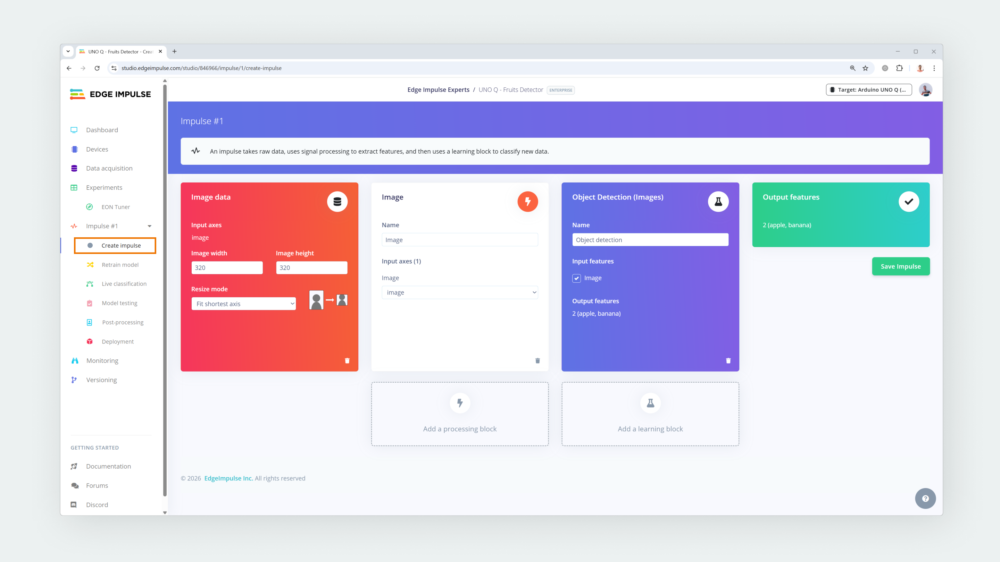

- **Image resolution:** 320x320 pixels in this case 
- **Processing block:** Image
- **Learning block:** Object Detection (Images)

Click on **Save Impulse** and navigate to the _Image processing block_ and leave the **Color depth** parameter in `RGB`, then, click on _Save parameters_ and finally on _Generate features_.

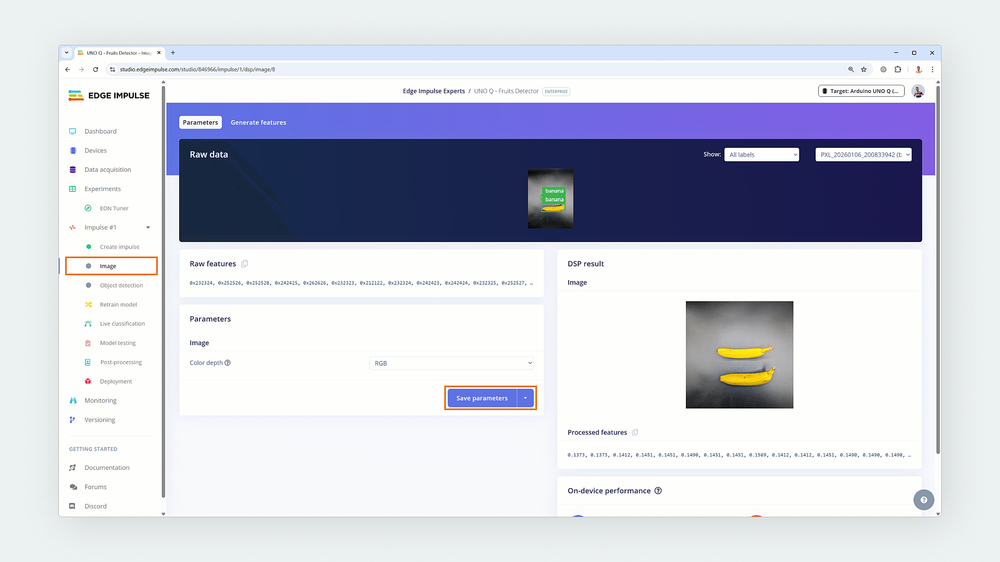

#### Neural Network Tuning

Getting the right settings for your Neural Network is a matter of time and trial and error. Follow the steps below for this model:

- Navigate to Object detection block in the left menu.
- Change the model to **MobileNetV2 SSD FPN-Lite 320x320** by clicking on "Choose a different model".

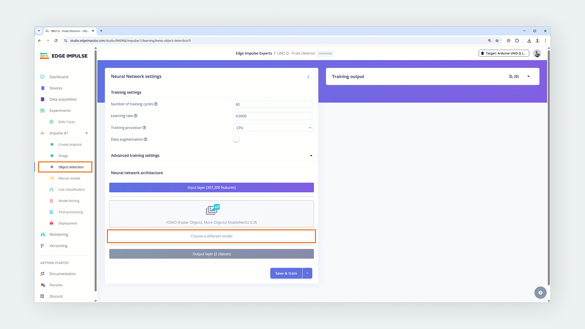

- Click on **Save & Train** with the default settings and wait for the training performance results.

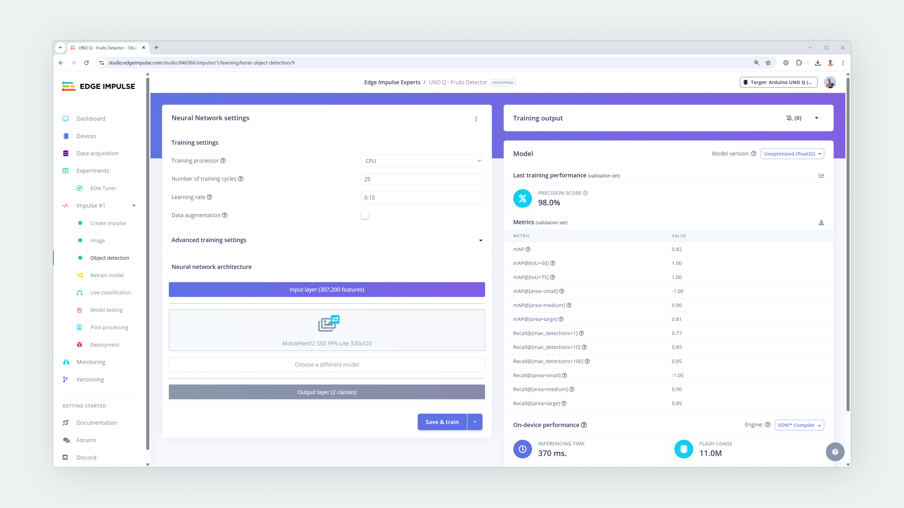

**Optimize Training Cycles:** 

The default is set to **25 cycles**. Monitor the training output.
- If the accuracy hits a plateau or the validation loss stops decreasing significantly by epoch 15 or 20, you can **reduce** the cycles to save time on future runs.
- If the accuracy is still climbing or the loss is still dropping when the process hits epoch 25, **increase** the number of cycles (e.g., to 40 or 50) to allow the model to finish learning.

**Refine the Learning Rate:** 

This model uses a high default learning rate of **0.15**.
- If the loss graph is volatile (jumping up and down wildly) or the model fails to converge, the model might be "overshooting" the optimal weights. **Reduce** the learning rate (e.g., try `0.1` or `0.05`).
- If the training is stable but the accuracy remains poor, you can try slightly **increasing** it, but be careful as this model is sensitive to high rates.

**Prevent Overfitting:** 

By default, **Data augmentation** is **disabled**.
- If your model performs perfectly on the training data (high accuracy) but fails when you point the camera at real objects (low real-world performance), the model is "overfitting."
- To fix this, **enable** Data augmentation. This randomly transforms your images during training, forcing the model to learn general features rather than memorizing exact pixels.

**Check On-Device Constraints:** 

Object Detection models like SSD are computationally heavy.
- **Inferencing time:** Verify that the inference time is low enough for your application (e.g., <500ms for ~2 FPS).
- **Hardware limits:** Ensure your device has enough RAM to hold the model. If you see warnings that the model is too large for your MCU, verify that your specific hardware (like the Arduino UNO Q) has the expanded memory required to run it.

In our case, the default settings give us good results:

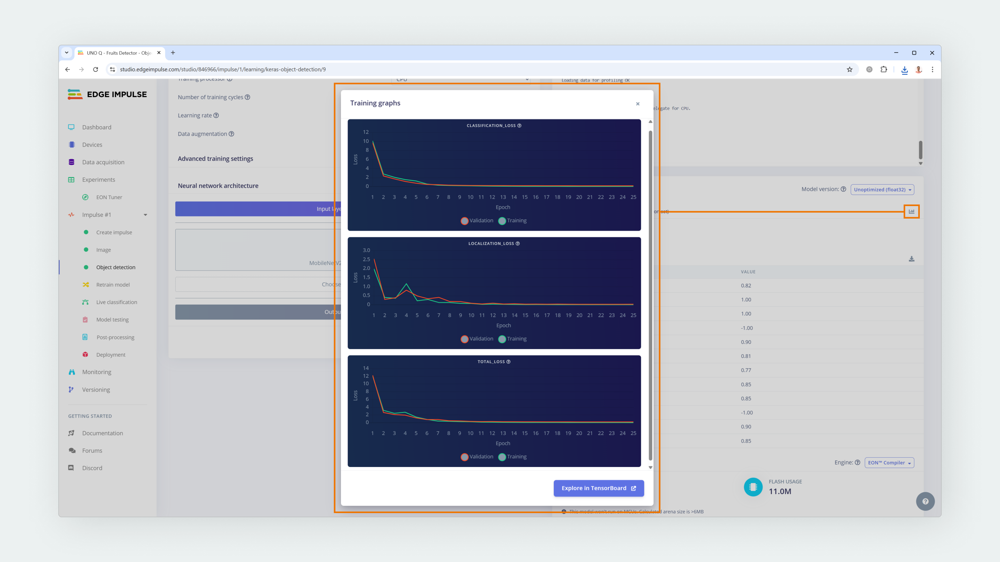

You can clone the model used on this tutorial from [here](https://studio.edgeimpulse.com/public/846966/live). 

***This is an example model with a very small dataset, it was created for demonstration purposes. You can improve it modifying it.***

#### Model Testing

To test your model's performance with new data, use the **Live classification** and **Model testing** sections. These tools allow you to verify how well your model detects apples and bananas in images that were not used during the training process.

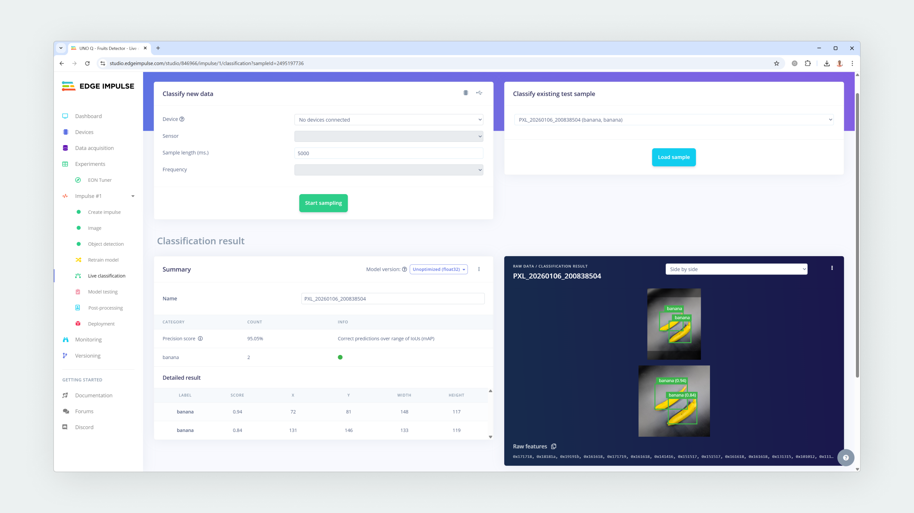

You can also test your model on your smartphone by using the same QR code we used for creating the dataset (also found in the **Deployment** section). This time tap on **Switch to classification mode**, wait for the model to be downloaded and started. Finally, go search for some apples and bananas with the camera.

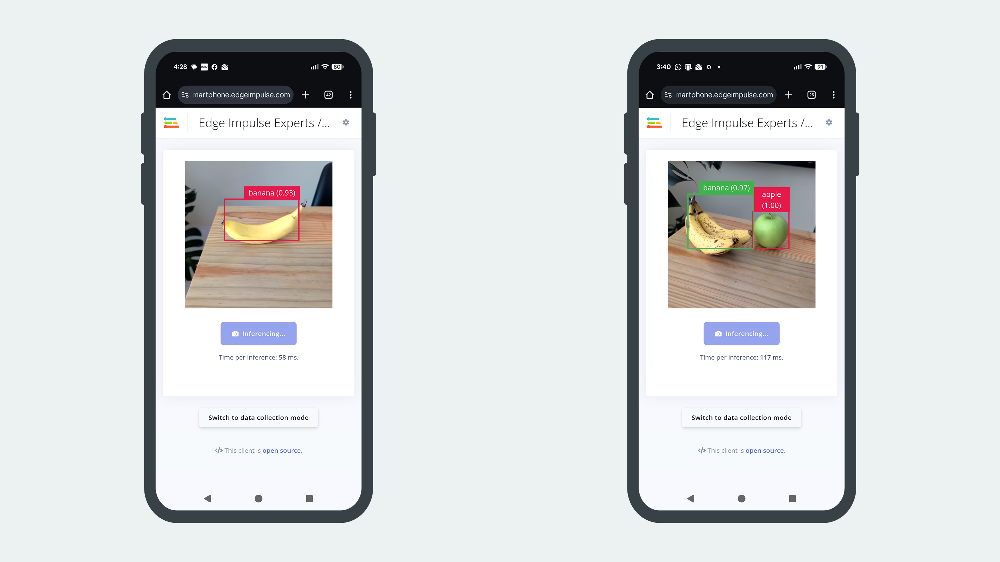

#### Model Deployment

As Edge Impulse Studio is paired with the Arduino App Lab, in the **Dashboard** section you will find a **Sync with Arduino App Lab** button that will import your model automatically.

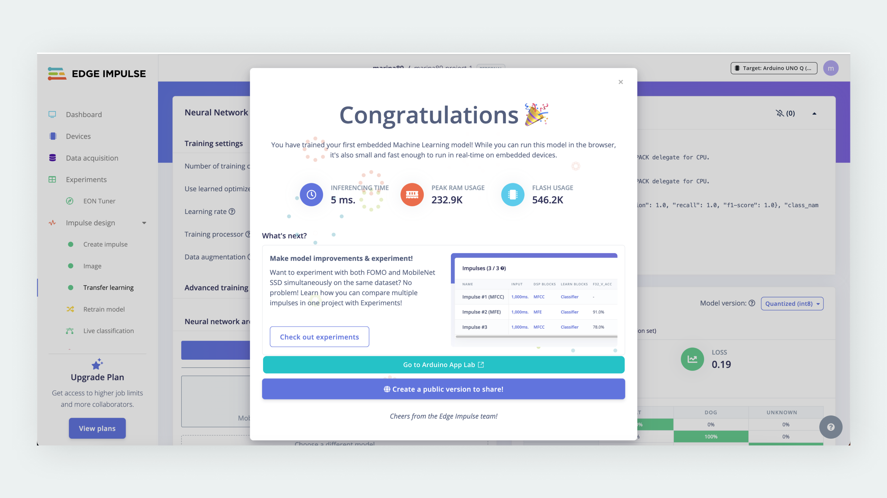

Also, you can export the Edge Impulse Model (.eim) for your UNO Q from the **Deployment** section and use it in your custom Python or C++ projects.

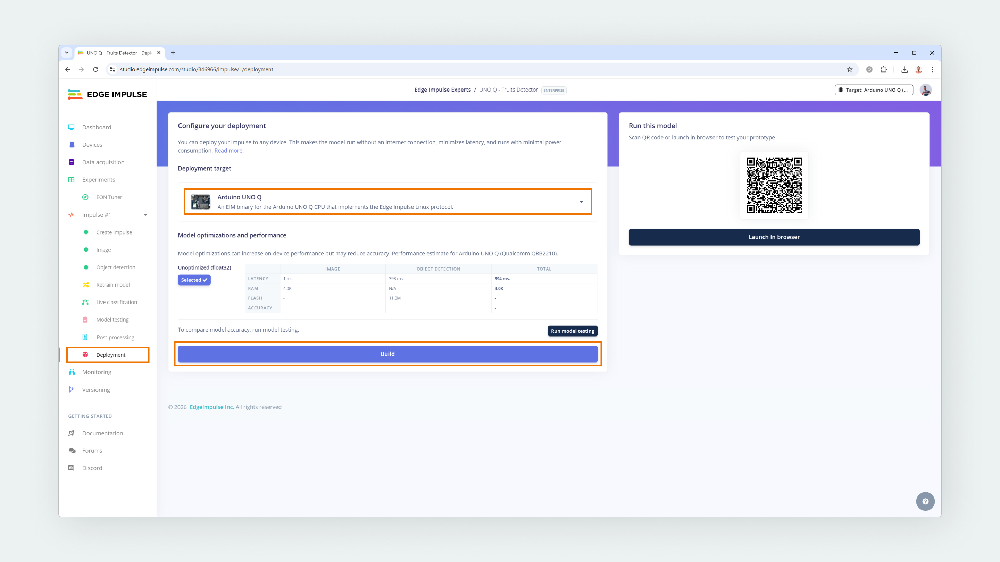

## Custom AI Model Usage

Once you come back from Edge Impulse Studio to the Arduino App Lab, your new model will appear in your Brick available models list. 

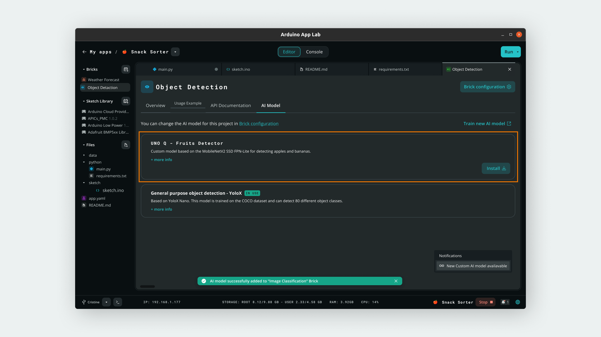

To use it in your App, click on the **Install** button and wait for it to be built and installed in your Arduino UNO Q. Finally, you can simply select your new model and run your App. 

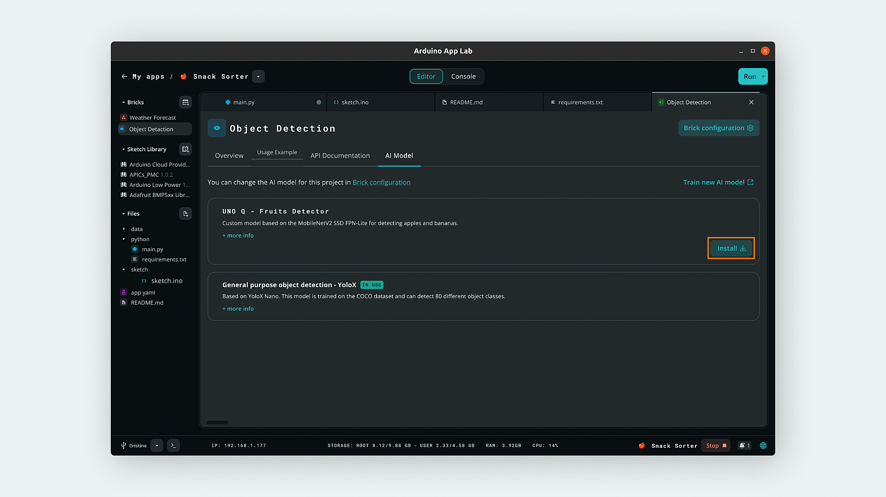

Now you are detecting apples and bananas with your UNO Q.

## Conclusion

In this tutorial, you learned how to extend the capabilities of Arduino App Lab by engineering and deploying custom AI models using Edge Impulse Studio. You explored the complete machine learning pipeline—from collecting a custom dataset of images to training a MobileNetV2 SSD object detection model optimized for the Arduino UNO Q.
Thanks to the seamless integration between Arduino App Lab and Edge Impulse, you can now swap generic "models" for specialized ones, enabling your Bricks to recognize specific objects like apples and bananas with high precision. This transforms your UNO Q from a simple computer into a tailored edge AI device capable of solving unique, real-world problems.

## Next Steps

* Expand your current dataset with more samples and variations (lighting, angles) to improve your object detection model's accuracy and robustness.
* Try creating an audio classification model using a USB microphone to teach your UNO Q to recognize voice commands or environmental sounds.
* Integrate your new custom model into a Logic flow within App Lab to trigger specific actions, such as turning on an LED or sending a notification, when a specific object is detected.
* Export the `.eim` file manually from Edge Impulse to experiment with running your custom model in C++ or Python projects outside of Arduino App Lab.

