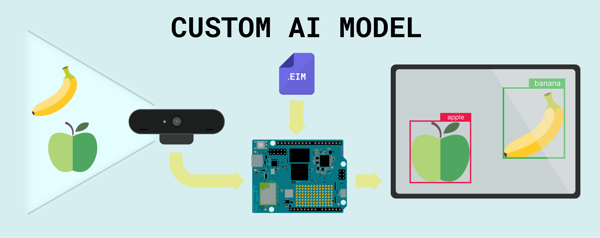

## Overview

Predefined models offer a powerful starting point for understanding edge AI. In this tutorial, we will extend those capabilities by engineering and deploying our own custom machine learning models. By moving to a custom workflow, we empower your Arduino App Lab applications to handle specialized tasks and unique datasets, ensuring the system is perfectly calibrated to your specific project goals.

By training our own models, we gain precise control over classification parameters and performance metrics, ensuring the system meets the specific requirements of your deployed environment rather than relying on generic solutions.

## Goals

* **Collect** a custom dataset for audio or image related models.
* **Train** a model from scratch in Edge Impulse Studio.
* **Integrate** your custom model into Arduino App Lab to customize your Bricks.

## Required Hardware and Software

### Hardware Requirements

* [Arduino UNO Q](https://store.arduino.cc/products/uno-q) (x1)
* USB Camera for image-based AI models
* USB microphone for audio-based AI models

### Software Requirements

- [Arduino App Lab](https://www.arduino.cc/en/software/#app-lab-section)
- Arduino Account (also works to log in Edge Impulse Studio)

## Machine Learning

To set the context, we need to understand what an "AI Model" actually is.

In the world of Traditional Programming, we write explicit rules: *If button A is pressed, turn on LED B.*
In **Machine Learning**, we don't write rules; we provide examples. We show the computer 100 photos of a "Banana" and 100 photos of an "Apple," and the computer figures out the rules to tell them apart itself. The result of that learning process is an **AI Model**.

By creating a custom model, you are essentially creating a new "brain" file that you can swap into your Arduino App Lab Bricks to change their behavior completely.

### Edge Impulse Studio

To create these custom models we use **Edge Impulse Studio**.

Edge Impulse is the leading development platform for embedded machine learning. Think of it as the "lab" where we prepare our AI. It handles the entire pipeline required to build a model that can run on the UNO Q.

#### The Workflow

Instead of writing code to define the neural network, you use the Studio's visual interface to guide the process:

1.  **Data Acquisition:** This is the most critical step. You collect/import images or audio samples to Edge Impulse. You can do this using your mobile phone, your computer, or even capture data directly from the UNO Q.
2.  **Impulse Design:** This is where you structure your "brain." You define an **Input block** (e.g., Audio or Image data), a **Processing block** (to clean up the data), and a **Learning block** (the neural network that learns the patterns).
3.  **Training:** The Studio uses its cloud servers to crunch the numbers. It will look at your data thousands of times until it learns to recognize the keywords or objects you defined.
4.  **Deployment:** Edge Impulse allows us to export the trained model specifically for the **Arduino UNO Q**, and it gets imported directly into our Arduino App Lab application.

When you export for the UNO Q, you get an **.eim (Edge Impulse Model)** file. This file acts like a container; it holds all the logic and trained parameters needed to run it.

## Creating your Custom AI Model

- In your custom App, navigate to your Brick in the left Arduino App Lab menu, "Object Detection" in this case, and select the **AI Models** tab. 

- The interface lists available models for your Brick, showing only the built-in Default model if no new ones have been trained.

- To start training your custom model, click on **Train new AI model**, if this is your first time, you will be guided through the Arduino account creation or log in.

- Your same Arduino account will be valid to log in into the Edge Impulse Studio. After loging in, you will be asked for consent to connect to Edge Impulse Studio.

- With your Arduino account and Edge Impulse now connected, click on **Start to Train your AI Model** button.

- Now, you should be redirected to the Edge Impulse Studio and asked for your model type for a guided tutorial or simply creating one from scratch.

### Image Based Models

To create a machine vision model for detecting objects or classifying images, follow the steps below:

#### New Project:

Create your first project by navigating to your profile picture (in the top-right corner) and clicking on **Create new project**. Select a name that resonates with your project’s objectives.

#### Classes:

Define the classes you want your model to detect (e.g., apples, bananas). Also, create a class called "unknown"

#### Dataset:

To train your model, you first need data. Start by creating a dataset of the objects you want to detect.

From your project **Dashboard**, click on **Collect new data**. You can build your dataset using your phone, computer, or the UNO Q itself, or by uploading existing images directly.

For convenience, we will use a smartphone. Scan the QR code to open the link, select the **Camera** option, and grant the necessary permissions.

Capture a variety of images for the classes you want to detect (e.g., apples and bananas). Additionally, Edge Impulse will create a class automatically called **background** to teach the model what to ignore based on your pictures.

***Note: You can label your images as you capture them, or label them later using the Edge Impulse labeling tools.***

#### Impulse Design

Create your Impulse in the Impulse Design section, here you will define your model settings:

- **Image resolution:** 320x320 pixels in this case 
- **Processing block:** Image
- **Learning block:** Object Detection (Images)

Navigate to the _Image processing block_ and leave the **Color depth** parameter in `RGB`, then, click on _Save parameters_ and finally on _Generate features_.

#### Neural Network Tuning

Getting to the right settings for your Neural Network is a matter of time and trial and error. Follow the steps below for this model:

- Change the model to **MobileNetV2 SSD FPN-Lite 320x320**.
  

- Click on **Train** with the default settings and wait for the confusion matrix to reveal the training performance results.

**Optimize Training Cycles:** 

The default is set to **25 cycles**. Monitor the training output.
- If the accuracy hits a plateau or the validation loss stops decreasing significantly by epoch 15 or 20, you can **reduce** the cycles to save time on future runs.
- If the accuracy is still climbing or the loss is still dropping when the process hits epoch 25, **increase** the number of cycles (e.g., to 40 or 50) to allow the model to finish learning.

**Refine the Learning Rate:** 

This model uses a high default learning rate of **0.15**.
- If the loss graph is volatile (jumping up and down wildly) or the model fails to converge, the model might be "overshooting" the optimal weights. **Reduce** the learning rate (e.g., try `0.1` or `0.05`).
- If the training is stable but the accuracy remains poor, you can try slightly **increasing** it, but be careful as this model is sensitive to high rates.

**Prevent Overfitting:** 

By default, **Data augmentation** is **disabled**.
- If your model performs perfectly on the training data (high accuracy) but fails when you point the camera at real objects (low real-world performance), the model is "overfitting."
- To fix this, **enable** Data augmentation. This randomly transforms your images during training, forcing the model to learn general features rather than memorizing exact pixels.

**Check On-Device Constraints:** 

Object Detection models like SSD are computationally heavy.
- **Inferencing time:** Verify that the inference time is low enough for your application (e.g., <500ms for ~2 FPS).
- **Hardware limits:** Ensure your device has enough RAM to hold the model. If you see warnings that the model is too large for your MCU, verify that your specific hardware (like the Arduino UNO Q) has the expanded memory required to run it.

In our case, the following settings give us good results:

#### Model Testing

To test your model's performance with new data, use the **Live classification** and **Model testing** sections. These tools allow you to verify how well your model detects apples and bananas in images that were not used during the training process.

You can also test your model on your smartphone by using the same QR code we used for creating the dataset (also found in the **Deployment** section). This time tap on **Switch to classification mode**, wait for the model to be downloaded and started, finally, go search for some apples and bananas with the camera.

#### Model Deployment

As Edge Impulse Studio is paired with the Arduino App Lab, in the **Dashboard** section you will find a **Sync with Arduino App Lab** button that will import your models automatically.

Also, you can export the Edge Impulse Model (.eim) for your UNO Q from the **Deployment** section and use it in your custom Python or C++ projects.

### Audio Based Models

## Custom AI Model Usage

Once you come back from Edge Impulse Studio to the Arduino App Lab, your new model will appear in your Brick available models list. 

To use it in your App, click on the **Install** button and wait for it to be built and installed in your Arduino UNO Q.

Finally, you can simply select your new model and run your App. 

Now you are detecting dogs or cats with your UNO Q.

## Machine Learning Models Best Practices

### Vision Models

### Audio Models

## Troubleshooting
