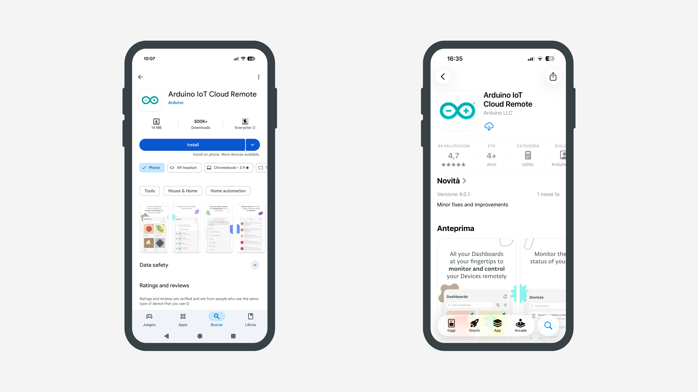

## Overview

In this tutorial, you will learn how to unlock your smartphone's potential within Arduino App Lab using the IoT Remote app. We will explore a powerful new feature that turns your phone into a wireless input device. Specifically, you will learn how to stream video from your phone directly to Arduino App Lab to power the Object Detection Brick, allowing you to run AI vision projects without needing a USB webcam.


**Note:** Your smartphone will be used as a remote camera input. Both the Arduino UNO Q and your smartphone must be connected to the same network.

## Goals

- Understand the integration between the IoT Remote app and the Arduino App Lab.
- Configure your smartphone to act as a wireless camera input for your projects.
- Test an example application using the Object Detection Brick sourced from the remote video feed.
- Run the project to detect and classify objects in real-time using your phone.

## Required Hardware and Software

### Hardware Requirements

* [Arduino UNO Q](https://store.arduino.cc/products/uno-q) (x1)
* Smartphone (iOS or Android)
* Personal computer with internet access (to view the Web UI)

### Software Requirements

- [Arduino App Lab](https://www.arduino.cc/en/software/#app-lab-section)
- [IoT Remote App](https://cloud.arduino.cc/iot-remote-app/)
- Arduino Account 

## Main Explanation

To test this feature we will leverage the **Mobile Object Detection** example inside the Arduino App Lab. This will allow us to easily learn how this feature works and try it out without the need of developing an App from scratch. 


***To stream your phone's camera feed to your UNO Q, both must be on the same network.***

### Arduino App Lab Setup

1. Ensure your Arduino UNO Q is powered and connected to the network.
2. Open Arduino App Lab in your computer.
3. Run the **Mobile Object Detection** example in Arduino App Lab.
4. The App should open automatically in the web browser. You can open it manually via `<board-name>.local:7000`.
5. The Web UI will display a **QR Code**.
  

### Arduino IoT Remote Setup

1. Install the [**Arduino IoT Remote**](https://cloud.arduino.cc/iot-remote-app/) app on your smartphone from your app store.
   
2. Open the Arduino IoT Remote app on your phone and log in with your Arduino account.
3. Go to Devices, tap on the plus icon to set up a new device and select **Stream phone camera to UNO Q**.
   
4. Scan the QR code.
   
5. Once connected, the video stream from your phone will appear on the Web UI.
6. Point your phone at objects and watch as the App detects and recognizes them.
   

## Mobile Integration Feature

To add the smartphone camera integration to your own custom Arduino App Lab application, you need to implement a specific handshake mechanism between your board and the phone. This consists of a Python backend that manages the secure connection and a JavaScript frontend that generates the pairing QR code.

### 1. Backend Implementation (`main.py`)

The backend is responsible for creating a secure "room" for the phone to connect to. You need to use the `WebSocketCamera` class and generate a one-time password (secret) that ensures only the intended phone connects to your board.

**Required Imports:**

```python
import secrets
import string
from arduino.app_peripherals.camera import WebSocketCamera
```

**Setup Logic:**

You must generate a random secret (OTP) and pass it to the `WebSocketCamera` instance. You also need to send these connection details to your frontend so it can generate the QR code.

```python
# 1. Generate a random 6-digit secret for security
def generate_secret() -> str:
    characters = string.digits
    return ''.join(secrets.choice(characters) for _ in range(6))

secret = generate_secret()

# 2. Initialize the Camera with the secret
# 'encrypt=True' ensures the handshake is secure
resolution = (480, 640)  # Portrait resolution for mobile devices
camera = WebSocketCamera(resolution=resolution, secret=secret, encrypt=True, adjustments=resized(resolution, maintain_ratio=True))

# 3. Send connection details to the Frontend when a client connects
# This passes the IP, Port, and Secret required for the QR Code
ui.on_connect(lambda sid: ui.send_message("welcome", {
    "client_name": camera.name,
    "secret": secret,
    "status": camera.status,
    "protocol": camera.protocol,
    "ip": camera.ip,
    "port": camera.port
}))
```

### 2. Frontend Implementation (`app.js`)

The frontend acts as the bridge. It receives the connection details from the backend and encodes them into a specific URL format inside a QR code. When the Arduino IoT Remote app scans this, it knows exactly where to send the video stream.

Prerequisites: Ensure you have a QR code library included in your HTML (e.g., `qrcode.min.js`).

**Handling the Handshake:**

In your `app.js`, listen for the "welcome" message from the backend. Use the data received to generate the pairing URL.

```javascript
// Listen for connection details from main.py
socket.on('welcome', async (message) => {
    // If the camera is not yet connected, generate the QR code
    if (message.status !== "connected") {
        generateQRCode(message.secret, message.protocol, message.ip, message.port);
    }
});

function generateQRCode(secret, protocol, ip, port) {
    const qrCodeContainer = document.getElementById('qrCodeContainer');
    
    // The specific URL format required by the IoT Remote App
    const connectionUrl = `https://cloud.arduino.cc/installmobileapp?otp=${secret}&protocol=${protocol}&ip=${ip}&port=${port}`;

    new QRCode(qrCodeContainer, {
        text: connectionUrl,
        width: 128,
        height: 128
    });
}
```

**Displaying the Stream:**

Once the phone connects, the video is not sent via WebSocket but served over HTTP on a specific port (default is usually `4912`). You should use an `<iframe>` to display it.

```javascript
// Logic to display video when status becomes 'streaming'
const streamUrl = `http://${window.location.hostname}:4912/embed`;
document.getElementById('videoIframe').src = streamUrl;
```

## Conclusion

In this tutorial, you learned how to transform your smartphone into a wireless input device for Arduino App Lab using the Arduino IoT Remote app. You successfully configured your network environment, paired your phone with the UNO Q via a QR code, and streamed live video to power an AI object detection model.

This integration eliminates the need for external USB webcams, allowing you to prototype computer vision applications more freely. By understanding the handshake mechanism between the Python backend and the JavaScript frontend, you now have the foundation to build custom applications that leverage the powerful sensors already present in your mobile device.

### Next Steps

- **Integrate into Custom Apps:** Use the code snippets provided in the "Mobile Integration Feature" section to add phone camera support to your own Arduino App Lab projects.
- **Experiment with Other Bricks:** Try feeding the mobile camera stream into different Bricks, such as the `video_classifier` or `face_detection` Bricks.
- **Optimize Performance:** Experiment with different video resolutions and frame rates in the `WebSocketCamera` configuration to balance quality and latency for your specific network conditions.